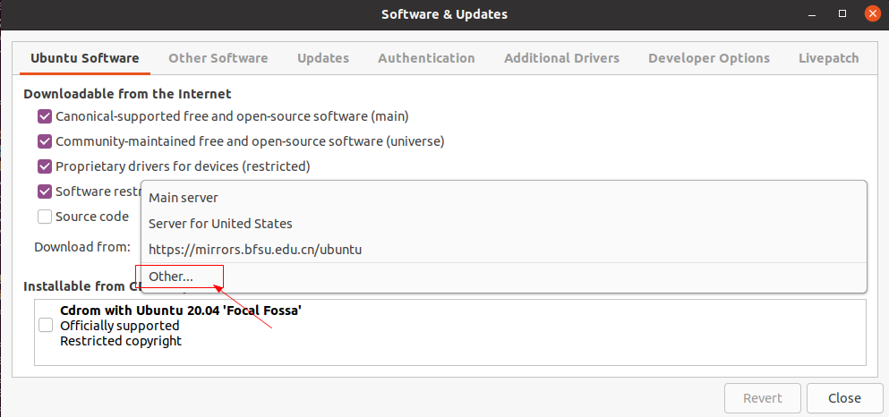
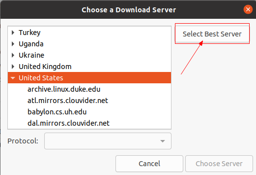

# Ubuntu更换软件源

新安装的Ubuntu系统，默认的软件源是国外的，下载的速度会很慢，所以让我们来把Ubuntu的软件软件源设置成国内的吧。

## 1.通过图像界面更换软件源

该方式操作简单，系统会自动选择出最合适的软件源。

```
Setting -> Software & Updates -> Ubuntu Software -> Download from -> Other -> Select Best Server
```





## 2. 通过命令行更换软件源

该方式需要我们自己寻找合适的软件源，然后手动更新。

* [阿里云开源软件镜像站-进入网站后选择自己使用的系统，比如：Ubuntu](https://developer.aliyun.com/mirror/)
* [清华大学开源软件镜像站](https://mirrors.tuna.tsinghua.edu.cn/help/ubuntu/)

```
sudo vim /etc/apt/sources.list
```
将：
```
archive.ubuntu.com
```
替换为：
```
mirrors.aliyun.com
```
或者：
```
mirrors.tuna.tsinghua.edu.cn
```

vim中首先进入命令模式（:），然后输入批量替换命令：

```
:%s/archive.ubuntu.com/mirrors.aliyun.com/g
```