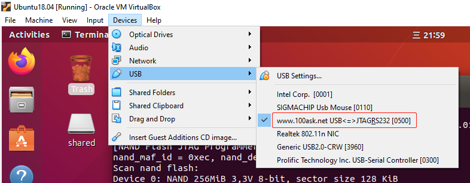
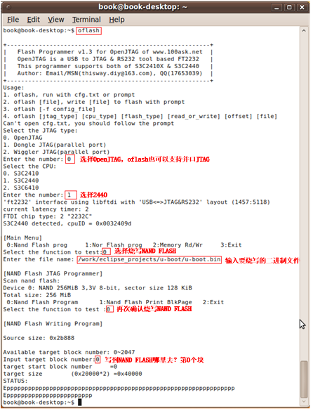

# EOP(Easy Open JTAG)

EOP百问科技出品的调试器，用于下载裸机程序。

EOP的驱动在Windows10下驱动安装十分麻烦，不想折腾可以在Ubuntu上使用EOP（免驱）。

[EOP for Ubuntu下载地址](https://pan.baidu.com/s/1Yz_5x_PRXMeIoEhU8I2G-g)

## 1. Ubuntu连接EOP




## 2. 使用方法1

```
# 要写文件的绝对路径
sudo oflash file_name.bin
```


## 3.使用方法2


```
sudo oflash
```

然后根据指令操作。


