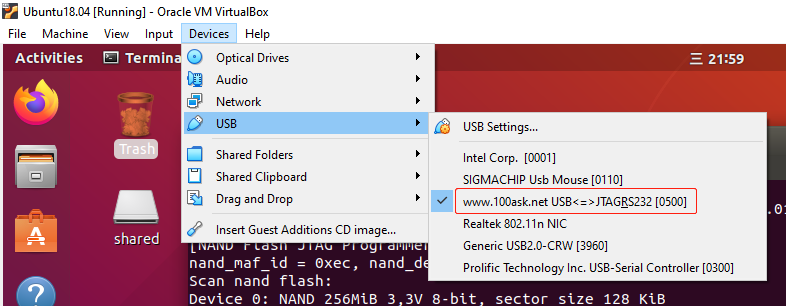
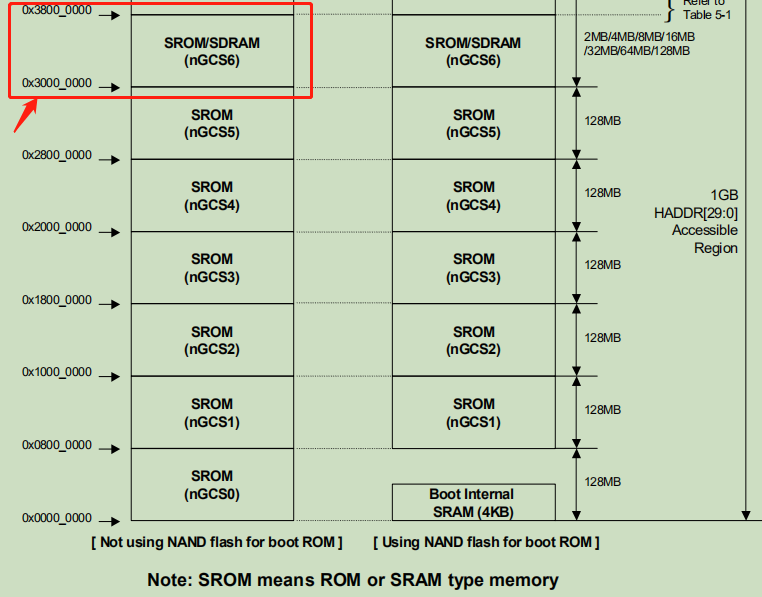

# JZ2440烧写镜像文件的方法

使用EOP(Easy Open JTAG)烧写Uboot，然后使用Uboot通过网络烧写Kernel和rootfs镜像文件。

EOP百问科技出品的调试器，用于下载裸机程序。

EOP的驱动在Windows10下驱动安装十分麻烦，不想折腾可以在Ubuntu上使用EOP（免驱）。

[EOP for Ubuntu下载地址](https://pan.baidu.com/s/1Yz_5x_PRXMeIoEhU8I2G-g)

## 1. 使用EOP烧写Uboot

### 1.1 Ubuntu连接EOP




EOP需要配合oflash软件使用，有两种使用方法，如下：

### 1.2 使用方法1

```
# 要写文件的绝对路径
sudo oflash file_name.bin
```


### 1.3 使用方法2

```
sudo oflash
```

然后根据指令操作。


## 2.使用Uboot烧写内核和文件系统

当烧写好Uboot后，我们就可以使用Uboot通过NFS（网络文件系统）或者TFTP（Trivial File Transfer Protocol）来烧写内核镜像和文件系统镜像了。

NFS和TFTP系统的搭建请参考：

* [NFS系统搭建](../embedded_linux_dev_env/nfs_server.md)
* [TFTP系统搭建](../embedded_linux_dev_env/tftp_server.md)

NFS或者TFTP服务器搭建好之后，将系统映像文件放入相应的工作目录。

### 2.1 配置IP

```
setenv ipaddr 192.168.2.17
setenv serverip 192.168.2.100
saveenv
```

### 2.2 查看Flash分区情况

在Uboot命令行执行如下命令：
```
mtdpart
```

```
device nand0 <nandflash0>, # parts = 5
 #: name                        size            offset          mask_flags
 0: bootloader          0x00040000      0x00000000      0
 1: device_tree         0x00020000      0x00040000      0
 2: params              0x00020000      0x00060000      0
 3: kernel              0x00400000      0x00080000      0
 4: root                0x0fb80000      0x00480000      0

active partition: nand0,0 - (bootloader) 0x00040000 @ 0x00000000

defaults:
mtdids  : nand0=nandflash0
mtdparts: mtdparts=nandflash0:256k@0(bootloader),128k(device_tree),128k(params),4m(kernel),-(root)
```

然后就会列出Flash的分区情况。在烧写内核和文件系统的时候，要严格按照这里的分区名称来写。


### 2.3 下载并烧写内核

```
nfs 30000000 192.168.2.200:/home/fhc/linux_driver/nfs/uImage
tftp 30000000 uImage

nand erase kernel

nand write.jffs2 30000000 kernel
```

### 2.4 下载并烧写文件系统

```
// 文件系统的大小不能超过内存的大小，否则下载会出错，所以一般将内存地址设置为内存的起始地址
nfs 30000000 192.168.2.200:/home/fhc/linux_driver/nfs/fs_qtopia.yaffs2
tftp 30000000 fs_qtopia.yaffs2

nand erase root

// nand write.[文件系统类型jaffs2或者yaffs] 文件源的内存地址  flash上的烧写地址  文件源的大小（网络下载后有提示）
nand write.yaffs 30000000 0x00260000 0x791340
```

### 2.5 为什么下载地址可以是0x30000000

是由S3C2440这颗芯片的内存控制器决定的，如下图所示：

