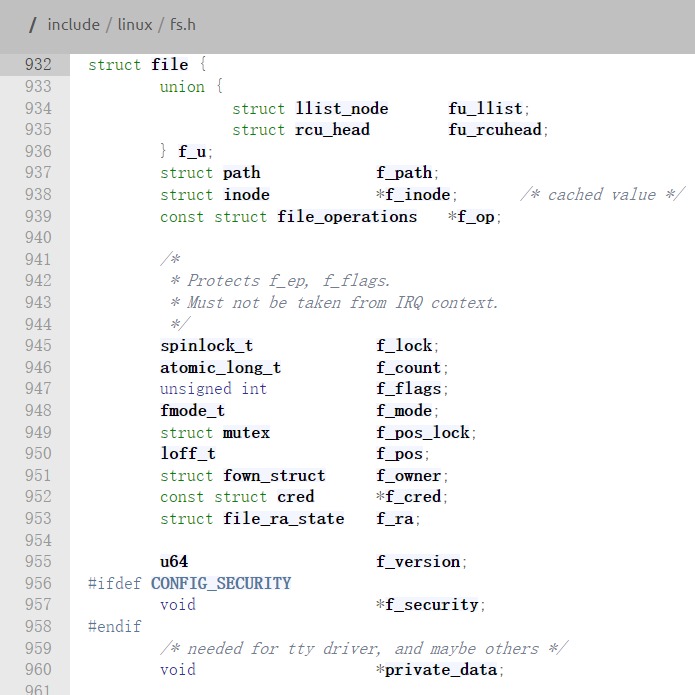

# Linux驱动程序架构

```c
int open(const char *pathname, int flags, mode_t mode);

/* On success, open(), return the new file
descriptor (a nonnegative integer).  On error, -1 is returned and errno is set to indicate the error. */
```

在Linux应用程序中，使用open()函数成功打开一个“文件”后，将会返回一个文件描述符（相当于指针）：一个file结构体变量如下所示：



```c
/include/linux/fs.h

struct file {
	union {
		struct llist_node	fu_llist;
		struct rcu_head 	fu_rcuhead;
	} f_u;
	struct path		f_path;
	struct inode		*f_inode;	/* cached value */
	const struct file_operations	*f_op;

	/*
	 * Protects f_ep, f_flags.
	 * Must not be taken from IRQ context.
	 */
	spinlock_t		f_lock;
	atomic_long_t		f_count;
	unsigned int 		f_flags;
	fmode_t			f_mode;
	struct mutex		f_pos_lock;
	loff_t			f_pos;
	struct fown_struct	f_owner;
	const struct cred	*f_cred;
	struct file_ra_state	f_ra;

	u64			f_version;
#ifdef CONFIG_SECURITY
	void			*f_security;
#endif
	/* needed for tty driver, and maybe others */
	void			*private_data;

#ifdef CONFIG_EPOLL
	/* Used by fs/eventpoll.c to link all the hooks to this file */
	struct hlist_head	*f_ep;
#endif /* #ifdef CONFIG_EPOLL */
	struct address_space	*f_mapping;
	errseq_t		f_wb_err;
	errseq_t		f_sb_err; /* for syncfs */
} __randomize_layout
  __attribute__((aligned(4)));	/* lest something weird decides that 2 is OK */

struct file_handle {
	__u32 handle_bytes;
	int handle_type;
	/* file identifier */
	unsigned char f_handle[];
};
```

同时open()函数的形参 int flags, mode_t mode 将会被赋值给file结构体的f_flags，f_mode变量。

另一方面，在内核启动时（或者加载驱动时），驱动程序会根据主次设备号，将自己注册到内核，然后内核根据设备号就能找到该驱动程序了。

同时被打开的这个“文件”是具有主次设备号的，内核根据主设备号找到相应驱动的file_operations结构体（包含read(),write()等操作函数），并将其赋值给file结构的f_op成员。

所以，应用程序拿到了open()函数返回的file结构，就可以对相应的文件（驱动设备）进行访问了。

