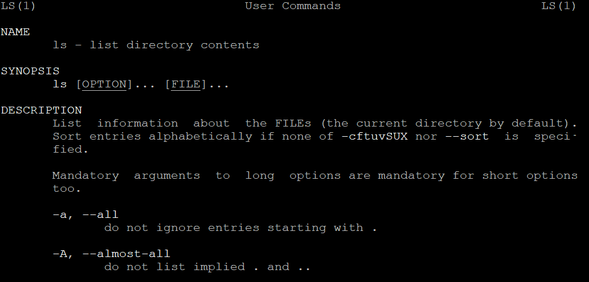
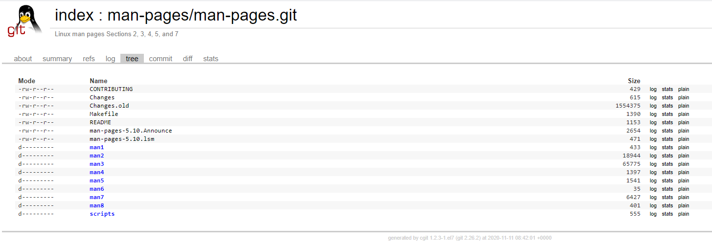
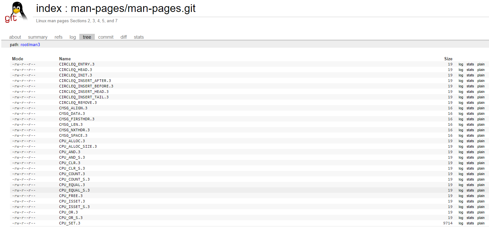
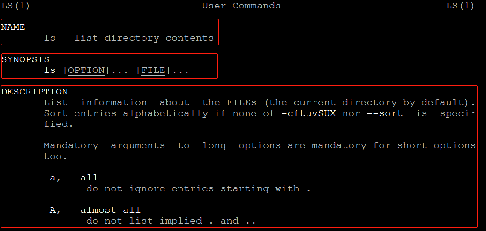
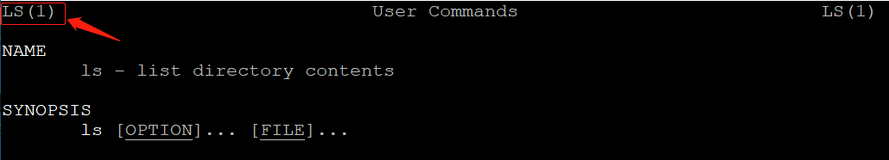

# Linux中的man-pages项目

https://www.kernel.org/doc/man-pages/
https://blog.csdn.net/Wyx_wx/article/details/79507823
https://www.cyberciti.biz/faq/howto-use-linux-unix-man-pages/

man 是 manual（手册） 的简写，在命令行执行 "man ls" 既可以出现关于 "ls" 命令或数据的详细操作说明:




其实这些文档都来自于一个叫做man-pages的项目:




man-pages项目是一组文档，由一个个的man-page组成，主要用于描述Linux内核和C库（主要是glibc）的API接口函数，以及Linux命令。




## man-page

一个man-page一般会包含以下信息：

|标号|说明|
|----|----|
|NAME|命令名称 + 一个简短的描述，用于简要说明该命令的主要作用|
|SYNOPSIS|简短的命令执行语法简介|
|DESCRIPTION|较为完整的说明|
|OPTIONS|针对 SYNOPSIS 部分中，有列举的所有可用的选项说明|
|COMMANDS|当这个程序在执行的时候，可以在此程序中执行的命令|
|FILES|这个程序或数据所使用或参考或连接到的某些文件|
|SEE ALSO|这个命令或数据有相关的其他说明|
|EXAMPLE|一些可以参考的范例|
|BUGS|是否有相关的错误|

以上这些内容并不一定都会全部出现在每一个man-page中，一般NAME, SYNOPSIS 和 DESCRIPTION是必须的。



## man-pages的章节

在man-pages项目中，这些man-page被分为8个章节（section）：

1: User commands; man-pages includes a very few Section 1 pages that document programs supplied by the GNU C library.
用户命令，比如ls cd pwd等

2: System calls documents the system calls provided by the Linux kernel.
系统调用API, 比如open(), write(), read()等

3: Library functions documents the functions provided by the standard C library.
标准C库函数，比如fopen(),fwrite(),fread()等

4: Devices documents details of various devices, most of which reside in /dev.
设备说明，这些设备一般位于/dev目录下，比如loop等

5: Files describes various file formats and filesystems, and includes proc(5), which documents the /proc file system.
文件格式和文件系统描述

7: Overviews, conventions, and miscellaneous.
概述，惯例和杂项

8: Superuser and system administration commands; man-pages includes a very few Section 8 pages that document programs supplied by the GNU C library.
系统管理员命令

我们使用 "man ls" 命令，打开关于 "ls" 的man-page，在左上角和右上角可以看到一个 "LS(1)" ，小括号里的1就表示该man-page是术语第一个章节的。



## man命令

建议查询 man page 时的步骤：

1. 如果你对这个要查询的命令不熟悉，首先应查询该命令位于man-pages的哪一个章节

* 如果你确切的知道要查询的命令的名字，可以直接查询该命令所在的章节
```
$man -f ls

ls (1)               - list directory contents
```

* 如果你不知道要查询的命令的完整名字，可以使用关键字查找
```
$man -k ls
```

2、然后在对应的章节中查看

注：章节1可以省略不写

```
$man ls
```

2. 仔细看一下 DESCRIPTION， 学习一些细节

3. 查询关于 OPTIONS 的部分，了解每个选项的意义

4. 查看 SEE ALSO 来看一下还有那些东西可以使用

5. 查看 FILES 部分的文件来参考


查询特定命令/文件的 man page 说明文件：

man -f [命令或数据]：

获取 [命令或数据] 的信息

下图执行: "man -f cal"