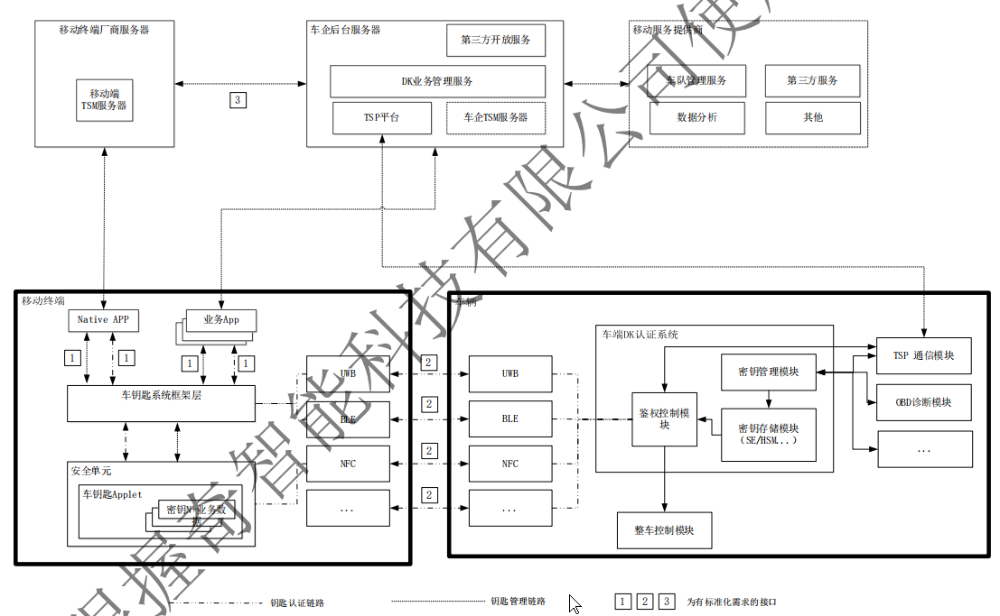

## 数字车钥匙（Digital Key）

车主身份数字化。而这把已经引起广泛关注的数字钥匙，将可作为车联网的关键性基础设施之一，构建起人与车之间可信的识别和连接体系，以进一步实现车人的真正合一，最大程度上削减车联网服务中所需的中间环节和第三方介质。数字车钥匙还可以实现人际流转，可控有序的分离车辆的使用权和所有权。

### 1. 数字车钥匙系统概述

数字车钥匙系统主要包括三个实体，即移动智能终端（移动终端或手机）、后台服务器与车辆。

* 移动终端为数字车钥匙的操作实体，用户可通过移动终端实现车辆的开门、启动等操作。
* 车辆具备车端数字车钥匙认证系统（也称为DK认证系统），用于实现移动终端与车身控制模块的安全交互。
* 后台服务器主要包括移动终端厂商服务器、车企（主机厂）后台服务器、移动服务提供商。后台服务器主要提供数字车钥匙业务管理、核心资产管理与OTA更新等功能。

为了数字钥匙的可互操作性，便利性，安全性和隐私保护等，需要一套标准来规范数字车钥匙系统的实现细节。目前有两种规范：

* 国际车辆数字钥匙标准，由CCC（Car Connectivity Consortium）主导编写 
* 国内的车辆数字钥匙标准，由智慧车联产业生态联盟（ICCE）主导编写

## 2.移动终端

## 3.车辆端
因为NFC与手机的操作系统是分开工作的，所以即使在智能手机电池电量不足的情况下，NFC也会运行并开门

## 4.后台服务端

## 钥匙使用

* PEPS(Passive Entry Passive Start)
* PKE(Passive Keyless Entry)被动无钥门禁系统
* PEPS与PKE应该是一样的，只是叫法不同，使用场景是：携带钥匙靠近车辆，直接拉动车辆门把手即可开启车门，携带钥匙进入车内后，直接按动 START按钮 就能启动车辆，全程不需要操作钥匙。

* RKE(Remote Keyless Entry)遥控门禁系统
* PKG(Passive Keyless Go)无钥匙启动

PESE/PKE RKE

## 接口要求

* MF: Master File
* ADF: Application Dedicated File
* Lc: Length of command data sent by the application layer
* Le: maximum Length of data expected by the application layer

* FCI:  file control information 
* FID: File identifier

## 参考链接

[参考链接](https://www.sohu.com/a/345573881_120342230)
