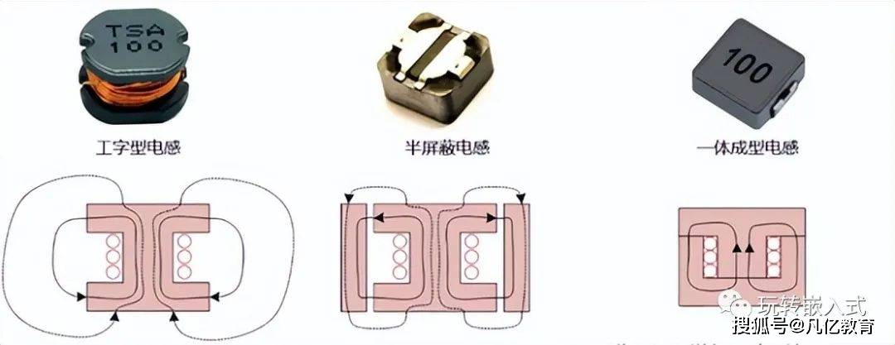
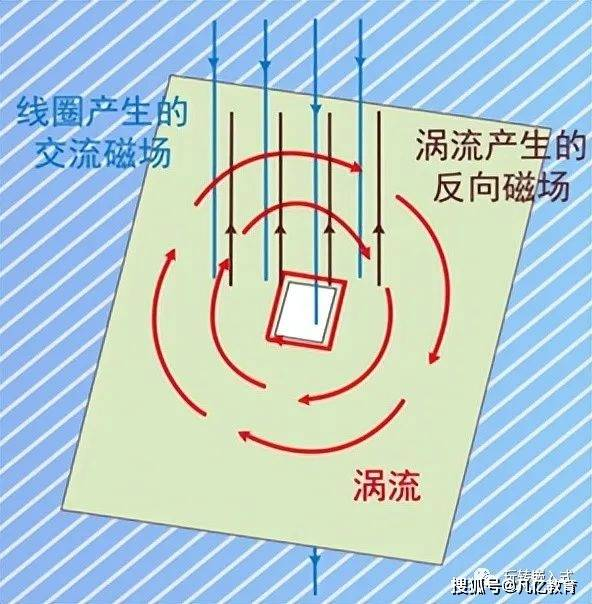
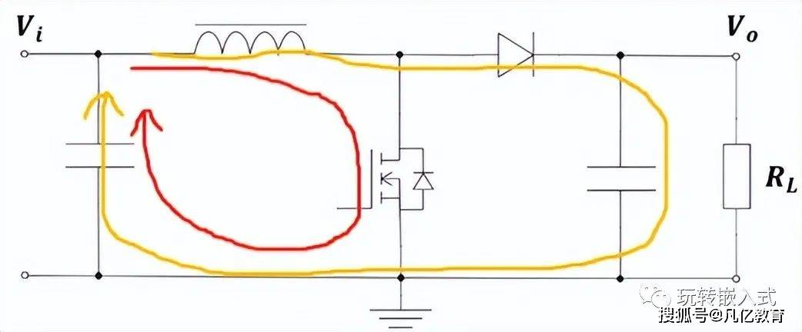
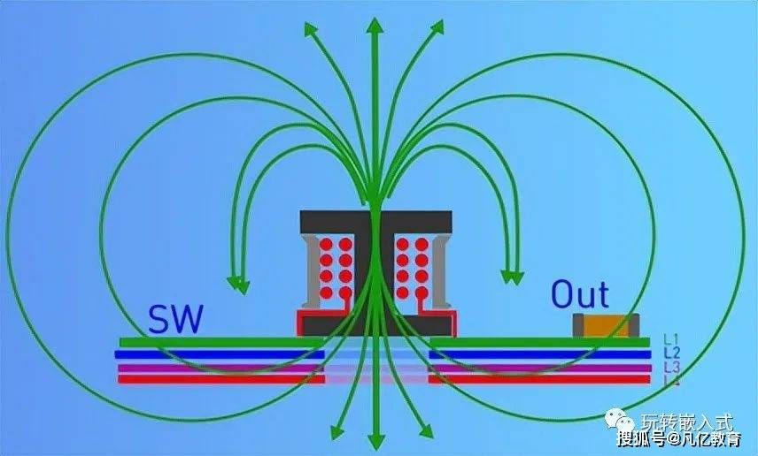
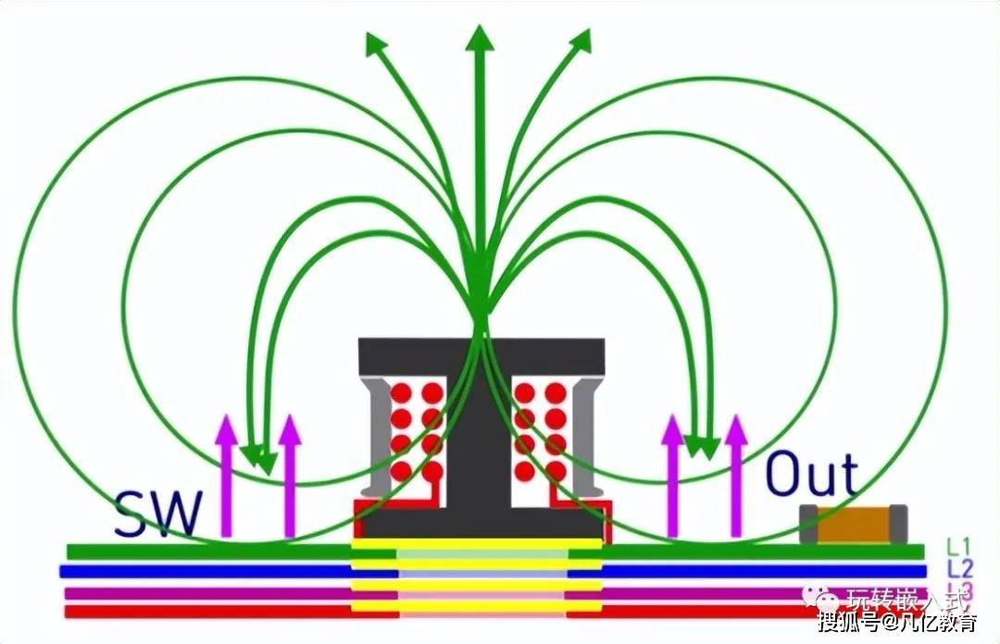

# 电感底部需要铺地吗？

[原文地址](https://www.sohu.com/a/535920139_100188064)

电感有交变电流，电感底部铺铜会在地平面上产生涡流，涡流效应会影响功率电感的电感量，涡流也会增加系统的损耗，同时交变电流产生的噪声会增加地平面的噪声，会影响其他信号的稳定性。

在EMC方面来看，在电感底部铺铜，完整的地平面铺铜有利于EMI的设计；现在的电感的生产工艺升级，电感采用屏蔽型电感，泄露的磁感线很少，对电感的感量影响不大，还能有利于散热。

实际工程中又该如何去选择呢？

工程中该如何选择，首先要了解电感的构造。我们常用电感有非屏蔽工字型电感、半屏蔽电感、一体成型电感。那它们有什么特点呢？

非屏蔽工字电感，磁路由磁芯和空气共同构成，其磁感线会完全暴露在空气中，没有任何的磁屏蔽。

半屏蔽电感，由其骨架结构可以看出，在工字电感的基础上，在电感外围增加了磁屏蔽材料。因为磁屏蔽材料的磁阻小，磁感线基本被锁定在导磁材料中，只有很少一部分的磁场会从气隙中泄露出来，所以能起到一定的屏蔽作用。

一体成型电感，在电感生产时将绕组和导磁材料一次铸造而成，内部只有很小的气隙，防止电感饱和，所以这种电感基本没有什么磁感线溢出。

实验非屏蔽工字电感和屏蔽电感铜皮对电感量的影响。

实验发现非屏蔽工字电感有铜皮的条件下，电感量有减小，而屏蔽型电感几乎没有影响。

电感底部敷铜与否对电源有什么影响呢？

思考这个问题前首先回顾了解下涡流效应。磁感线由N到S级，存在交变磁场经过导体表面时，由电磁感应定律可知，在导体表面形成感应电流，感应电流产生的磁场方向总是会起到消弱原磁场大小的作用。

下面是Boost升压DC/DC电路电流环路的情况，来聊聊电感底部敷铜对电源设计的影响。

当Boost升压正常工作时，电感中流过负载电流，形成回路。由于开关管的存在，电流是动态变化的，由此可形成电感的磁感线，在导体的表面部分磁感线回形成封闭的磁回路，部分磁路会形成漏磁溢出到空气中。如果电感底部没有敷铜时，从电感中溢出的磁感线会在整个电源系统中存在，使系统没有相对安静的空间，会造成EMI的性能下降。

如果电感底部敷上完整的铜时，在电感的底部平面会产生涡流效应，涡流会将抵消部分漏感产生的磁场，使得原漏磁感应线消弱。电感底部敷铜，产生的涡流就如同电磁屏蔽罩一样，阻断了磁感应线向下传播，因而可以将电感产生的高频磁场屏蔽在导体的一面，这样极大的减小高频磁场对空间中其他元器件的影响。

从两个角度来看，站在EMI的角度，建议敷铜；站在电感感量的角度，屏蔽型电感感量没有影响，所以也建议敷铜，而仅工字电感底部敷对电感感量有少许影响，所以在实际的工程中视情况而定。

在实际的PCB布局中，开关出的滤波器放在与电感相反的PCB平面，更有利于避免高频干扰滤波元器件，防止高频干扰通过线传输出去。