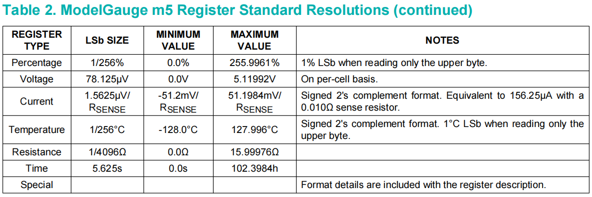

# MAX17261



LSB SIZE指的是1 bit值所代表的数值

假设寄存器中取出的值为reg

* Percentage

实际的剩余电量：
```c
SOC=reg*(1/256%)
```

* Voltage

实际的电压：
```c
VOL=reg*78.125uV
```

* Current

电流有正负之分，为short型变量，实际的电流：

```c
short CUR=reg*1.5625uV/R(Ω)
```
