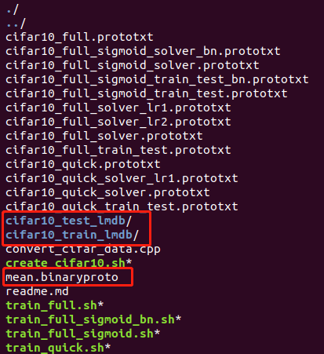

# ML On MCU

## 1.从源码安装Caffe


## 2.模型量化

### 2.1 获取CIFAR-10数据集

[Caffe CIFAR-10说明](https://caffe.berkeleyvision.org/gathered/examples/cifar10.html)

```
cd $CAFFE_ROOT

# 下载CIFAR-10数据集
./data/cifar10/get_cifar10.sh

# 创建训练、测试数据集
./examples/cifar10/create_cifar10.sh
```
成功获取CIFAR-10数据集后在/path/to/caffe/examples/cifar10目录下将会新增三个文件，如下图所示：



### 2.2 使用ARM官方提供的脚本对模型进行量化

[ARM官方提供的量化脚本](https://github.com/ARM-software/ML-examples/tree/master/cmsisnn-cifar10)


* 修改脚本

修改cifar10_m7_train_test.prototxt中训练、测试集的路径：

将mean_file和source的路径进行修改

```
layer {
  name: "data"
  type: "Data"
  top: "data"
  top: "label"
  include {
    phase: TRAIN
  }
  transform_param {
    mean_file: "/home/ubuntu/caffe/examples/cifar10/mean.binaryproto"
  }
  data_param {
    source: "/home/ubuntu/caffe/examples/cifar10/cifar10_train_lmdb"
    batch_size: 100
    backend: LMDB
  }
}

layer {
  name: "data"
  type: "Data"
  top: "data"
  top: "label"
  include {
    phase: TEST
  }
  transform_param {
    mean_file: "/home/ubuntu/caffe/examples/cifar10/mean.binaryproto"
  }
  data_param {
    source: "/home/ubuntu/caffe/examples/cifar10/cifar10_test_lmdb"
    batch_size: 100
    backend: LMDB
  }
}

```


* 量化模型
```
cd /path/to/cmsisnn-cifar10

python nn_quantizer.py --model models/cifar10_m7_train_test.prototxt --weights models/cifar10_m7_iter_300000.caffemodel.h5 --save models/cifar10_m7.pkl
```

* 生成C代码
```
cd /path/to/cmsisnn-cifar10

python code_gen.py --model models/cifar10_m7.pkl --out_dir code/m7
```

