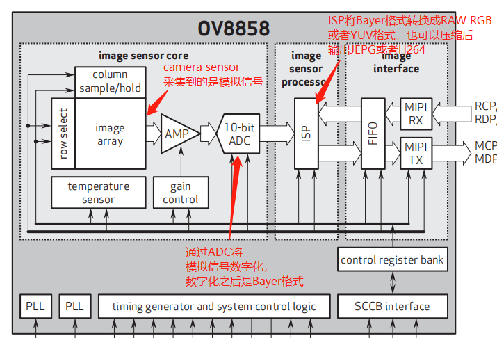

# 码率、H264 Profile 和 level

## 1. 数字成像原理



Camera Sensor出来的是Bayer格式，然后处理成RAW RGB or YUV输出，也可以按照JEPG或者H264压缩后输出。

Bayer格式是相机内部的原始图片, 一般后缀名为.raw。很多软件都可以查看, 比如PS。


CMOS和CCD也能以模式的方式输出视频数据，一般是PAL制式的，可以直接连接支持PAL的显示器，直接显示。


## 2.怎么计算一幅图像的大小

一幅图像包括的基本东西就是二进制数据，其容量大小实质即为二进制数据的多少。一幅1920x1080像素的YUV422的图像，大小是1920X1080X2=4147200（十进制），也就是3.95M大小。这个大小跟多少个像素点和数据的存储格式有关。下面简述yuv与像素的关系：

YUV与像素的关系：

YUV是利用一个亮度（Y）、两个色差(U,V)来表示一个像素。

传统的RGB三原色使用红绿蓝三原色表示一个像素，每种原色占用一个字节（8bit），因此一个像素用RGB表示则需要8\*3=24bit。

如果使用YUV表示这个像素，假设YUV的采样率为：4：2：0，即每一个像素对于亮度Y的采样频率为1，对于色差U和V，则是每相邻的两个像素各取一个U和V。对于单个的像素来说，色差U和V的采样频率为亮度的一半。如有三个相邻的像素，如果用RGB三原色表示，则共需要占用：8\*3\*3=72bits；如果采用YUV（4：2：0）表示，则只需要占用：8\*3（Y）+ 8\*3\*0.5（U）+8\*3\*0.5（V）= 36bits。只需原来一半的空间，就可以表示原来的图像，数据率压缩了一倍，而图像的效果基本没发生变化。


## 1. 码率

一个摄像头其图像分辨率是1280\*720，图像格式是YUV420（一个像素占2个字节），帧率是30FPS，那么其码率是：1280\*720\*\2*30 = 55Mbps

摄像头原生的的数据量非常之大，在传输时通常会将其压缩，比如采用H264压缩。

既然是压缩，那就有压缩比，通常通过设置编码器的码率这个参数来确定压缩比。

比如设置编码器的码率为1Mbps，那么该摄像头视频数据的压缩比是：55:1，压缩了55倍。

在其他条件一致的前提下，通常码率越高，视频质量就越高，视频占用的空间就越大。

那么追求高质量视频时，是不是码率越高越好呢？

那么追求普通质量视频时，是不是码率越底越好呢？

答案是：不一定


那么一般怎么选择码率呢？

于是H264给出了Prifile和level的概念。详细请参考：

[Advanced Video Coding](https:\\en.wikipedia.org\wiki\Advanced_Video_Coding)


[参考链接](https://blog.csdn.net/jefry_xdz/article/details/8299901)


## 在Android中设置H264编码器的Profile和level

[参考链接](https:\\stackoverflow.com\questions\22611451\set-avc-h-264-profile-when-encoding-video-in-android-using-mediacodec-api)

```java
\\在Android中设置H264编码器的Profile和level

format.setInteger("profile",MediaCodecInfo.CodecProfileLevel.AVCProfileBaseline);
format.setInteger("level", MediaCodecInfo.CodecProfileLevel.AVCLevel13);
```


