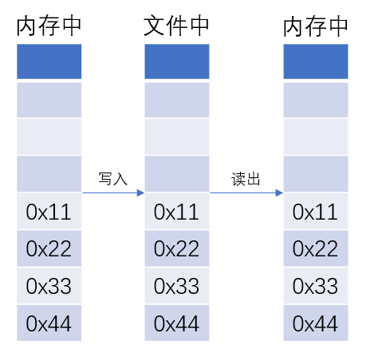
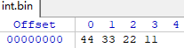

# OPUS音频编解码库

## 1.基本概念

### 1.1 Frame Size
每通道的采样数，音频的帧以时间为单位，在OPUS中Frame size必须是2.5, 5, 10, 20, 40 or 60 ms


### 1.2 小端模式



如上图所示，一个整数0x11223344，在内存中、写入文件中、从文件中读出，从字节的角度看，其存储方式是一样的。

示例程序如下：

```c

unsigned int a = 0x11223344;

unsigned char *p = &a;

// 查看在内存中的存储情况
printf("%x,%x,%x,%x\n",*p,*(p+1),*(p+2),*(p+3));

FILE *fp;
fp = fopen("int.bin","w+");

// 写入文件后，通过二进制查看工具查看，其在文件中的存储情况
fwrite(&a,sizeof(int),1,fp);

fseek(fp,0,SEEK_SET);

unsigned char *buf = (unsigned char *)malloc(4);

fread(buf,sizeof(int),1,fp);

// 查看从文件读出后的存储情况
printf("%x,%x,%x,%x\n",buf[0],buf[1],buf[2],buf[3]);

```
在文件中的存储情况如下图所示：



!!! Warning
    如果你将int或者short类型的数据以二进制写入文件，然后以字节读出。然后在将字节数据转换为int或者short的时候，
	请注意字节序问题（**不推荐这种做法**），示例如下：
	
```c
#define FRAME_SIZE 960
#define CHANNELS 1
#define MAX_FRAME_SIZE 6*960

opus_int16 in[FRAME_SIZE*CHANNELS];
unsigned char pcm_bytes[MAX_FRAME_SIZE*CHANNELS*2];

/* Convert from little-endian ordering. */
for (i=0;i<CHANNELS*FRAME_SIZE;i++)
 in[i]=pcm_bytes[2*i+1]<<8|pcm_bytes[2*i];
```

> **一般直接将指向字节数组的指针（char *）转换为指向int或者short的指针即可。示例如下：**

```c

unsigned short *short_buf = (unsigned short *)pcm_bytes;

```

如果是16bit采样，那么一个样本需要用2个字节（short）去存储。

OPUS的编码函数原型如下所示：
```c

opus_int32 opus_encode	(OpusEncoder * 	    st,
                         const opus_int16 * pcm,
                         int 	            frame_size,
                         unsigned char * 	data,
                         opus_int32 	max_data_bytes 
)	

```


