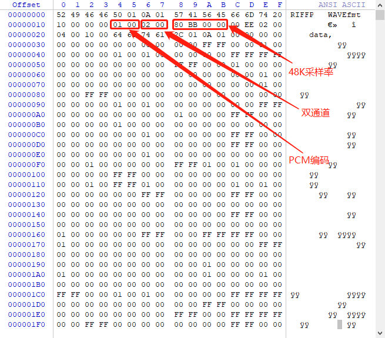

# WAV格式简介

[reference link](http://soundfile.sapp.org/doc/WaveFormat/)

WAV = PCM数据 + WAV文件头

* 数据块的记录方式是little-endian字节顺序

* WAV头格式如下：

|offset address|size|type|content|
|--------------|----|----|-------|
|00H~03H|4|char|资源交换文件标志（RIFF）|
|04H~07H|4|int32|从下个地址开始到文件尾的总字节数
|08H~0BH|4|char|WAV文件标志（WAVE）
|0CH~0FH|4|char|波形格式标志（fmt ），最后一位空格。
|10H~13H|4|int32|过滤字节（一般为00000010H），若为00000012H则说明数据头携带附加信息（见“附加信息”）。
|14H~15H|2|int16|格式种类（值为1时，表示数据为线性PCM编码）
|16H~17H|2|int16|通道数，单声道为1，双声道为2
|18H~1BH|4|int32|采样频率
|1CH~1FH|4|int32|波形数据传输速率（每秒平均字节数）
|20H~21H|2|int16|DATA数据块长度，字节。
|22H~23H|2|int16|PCM位宽
|随后2字节|2|int16|附加信息（可选，由上方过滤字节确定）
|随后|...|不定长度字符	|“fact”,该部分是可选部分，一般当WAV文件是由某些软件转换而来时，包含该部分。若包含该部分：（1）该部分的前4字节为数据头，一般为4个字母。（2）随后4个字节表示长度，即除去头（4字节）和长度（4字节）之后，数据本身的长度。（3）最后的字节为数据本身。例如：“66 61 73 74 04 00 00 00F8 2F 14 00” 。“66 61 73 74”是fact字段的数据头，“04 00 00 00”是数据本身的长度，“F8 2F 14 00”是数据本身。（注意是little-endian字节顺序）
|随后4字节|4|cahr|数据标志符（data）
|随后4字节|4|int32|DATA总数据长度字节
|随后|...|DATA数据块

* 示例

