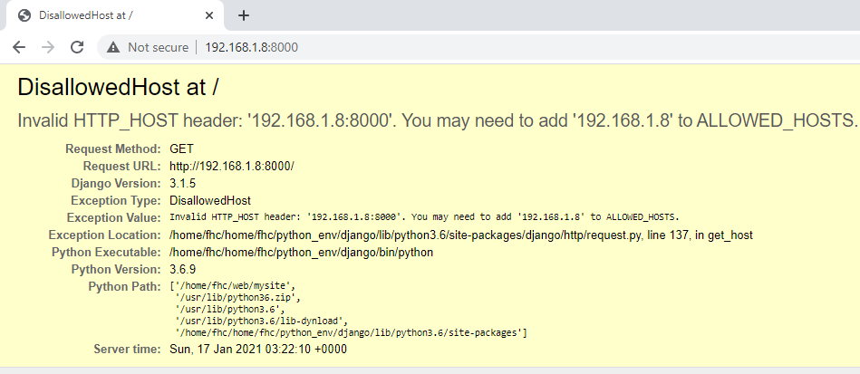
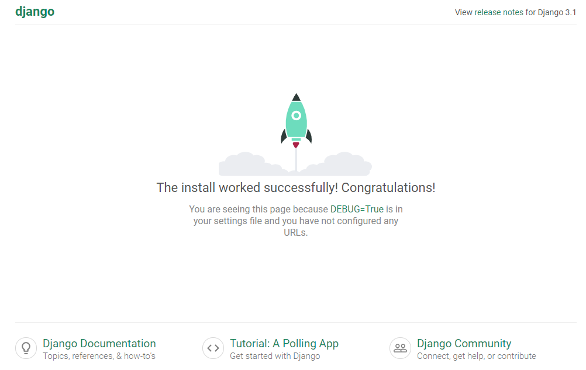
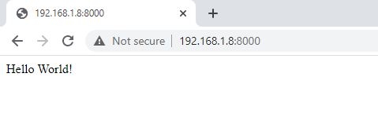

# 将Django Wbe APP部署到Nginx服务器

[参考连接1](https://tonyteaches.tech/django-nginx-uwsgi-tutorial/)

## 1.安装Django

首先配置Python，推荐使用python3

* 安装python3-venv
```
$ sudo apt-get install python3-venv
```

* 设置Python3虚拟工作环境
```
$ mkdir /home/fhc/python_env
$ python3 -m venv home/fhc/python_env/django
$ source home/fhc/python_env/django/bin/activate
```

* 安装Django

```
pip install django
```

## 2. 创建第一个Django Web App

* 创建Web App
```
$ django-admin.py startproject mysite

# /home/fhc/mysite
$ cd mysite
```

* 运行Web App

我们这里使用Diango内置的一个测试级别的web服务器，请勿在生产环境使用该测试级别的Web服务器。

```
$ python manage.py runserver 0.0.0.0:8000
```

然后你就可以在浏览器地址栏输入http://your_ip:8000/ (eg: http://192.168.1.8:8000/) 访问该网站了。

可能会出现下面的错误信息：



将服务器IP地址或者域名写入mysite/settings.py中：

```python
ALLOWED_HOSTS = ['192.168.1.8']
```
刷新网页（http://your_ip:8000/）这次你将会看到正确的Django欢迎页面：



## 3. 安装uWSGI

* WSGI原理


```
# 请先确认你的python版本
sudo apt-get install python3.6-dev
sudo apt-get install gcc
pip install uwsgi
```

编写一个测试文件 test.py，然后测试是否安装正确:

```python
def application(env, start_response):
    start_response('200 OK', [('Content-Type','text/html')])
    return [b"Hello World!"]
```

执行如下命令：
```
uwsgi --http :8000 --wsgi-file test.py
```

然后在浏览器地址栏输入http://your_ip:8000/，如果看到如下界面，就说明你的安装时正确的：



* 使用UWSGI访问你的Django Web App

```
uwsgi --http :8000 --module mysite.wsgi
```

如果一切运行正常，刷新网页（http://your_ip:8000/）你将看到正确的Django欢迎页面：


## 4.使用Nginx作为静态网页Web服务器


* Nginx配置

打开配置文件：
```
$ sudo vim /etc/nginx/sites-available/mysite
```

在配置文件中写入下面的内容：

```
# the upstream component nginx needs to connect to
upstream django {
    server unix:///home/fhc/web/mysite/mysite.sock;
}
# configuration of the server
server {
    listen      80;
    server_name localhost;
    charset     utf-8;
    # max upload size
    client_max_body_size 75M;

    # Django media and static files
    location /media  {
        alias /home/fhc/web/mysite/media;
    }

    location /static {
        alias /home/fhc/web/mysite/static;
    }

    # Send all non-media requests to the Django server.
    location / {
        uwsgi_pass  django;
        include     /home/fhc/web/mysite/uwsgi_params;
    }
}
```

* 创建/home/fhc/web/mysite/uwsgi_params文件

```
uwsgi_param  QUERY_STRING       $query_string;
uwsgi_param  REQUEST_METHOD     $request_method;
uwsgi_param  CONTENT_TYPE       $content_type;
uwsgi_param  CONTENT_LENGTH     $content_length;
uwsgi_param  REQUEST_URI        $request_uri;
uwsgi_param  PATH_INFO          $document_uri;
uwsgi_param  DOCUMENT_ROOT      $document_root;
uwsgi_param  SERVER_PROTOCOL    $server_protocol;
uwsgi_param  REQUEST_SCHEME     $scheme;
uwsgi_param  HTTPS              $https if_not_empty;
uwsgi_param  REMOTE_ADDR        $remote_addr;
uwsgi_param  REMOTE_PORT        $remote_port;
uwsgi_param  SERVER_PORT        $server_port;
uwsgi_param  SERVER_NAME        $server_name;
```
* 创建static和media文件夹
```
$cd mysite
$mkdir media
$mkdir static
```
在settings.py中设置静态文件存储目录为mysite/static:

```
import os

...

STATIC_URL = '/static/'
STATIC_ROOT = os.path.join(BASE_DIR, "static/")
```

* 在/etc/nginx/sites-enabled/文件夹中创建nginx配置文件的符号链接

```
sudo ln -s /etc/nginx/sites-available/mysite.conf /etc/nginx/sites-enabled/
```

* 重启nginx
sudo /etc/init.d/nginx restart


启动：
```
uwsgi --socket mysite.sock --module mysite.wsgi --chmod-socket=666
```

* 产品级uwsgi配置

在命令传递参数比较繁琐容易出错，可以将这些参数统一写入一个配置文件mysite_uwsgi.ini，方便管理。

```
[uwsgi]
# full path to Django project's root directory
chdir            = /home/fhc/mysite/
# Django's wsgi file
module           = mysite.wsgi
# full path to python virtual env
home             = home/fhc/python_env/django
# enable uwsgi master process
master          = true
# maximum number of worker processes
processes       = 10
# the socket (use the full path to be safe
socket          = /home/fhc/mysite/mysite.sock
# socket permissions
chmod-socket    = 666
# clear environment on exit
vacuum          = true
# daemonize uwsgi and write messages into given log
daemonize       = /home/fhc/mysite/uwsgi-emperor.log
```

启动uwsgi时，将改配置文件作为参数传入即可：
```
uwsgi --ini mysite_uwsgi.ini
```