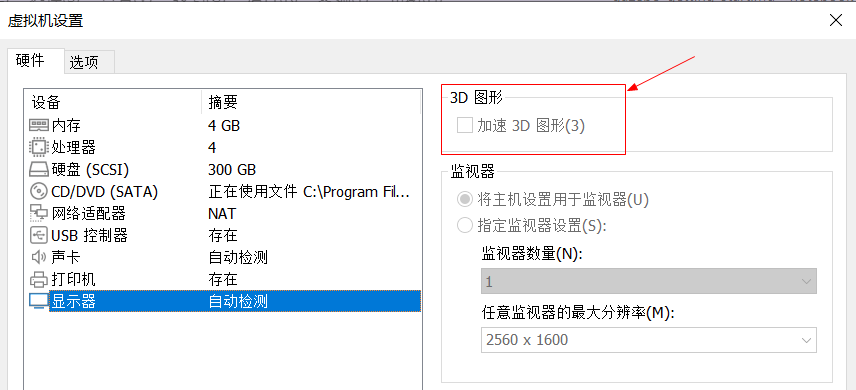
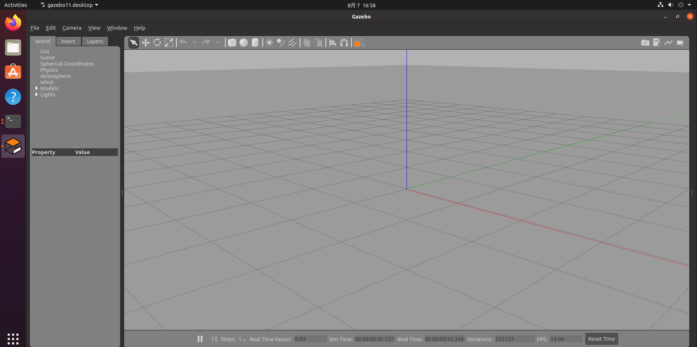
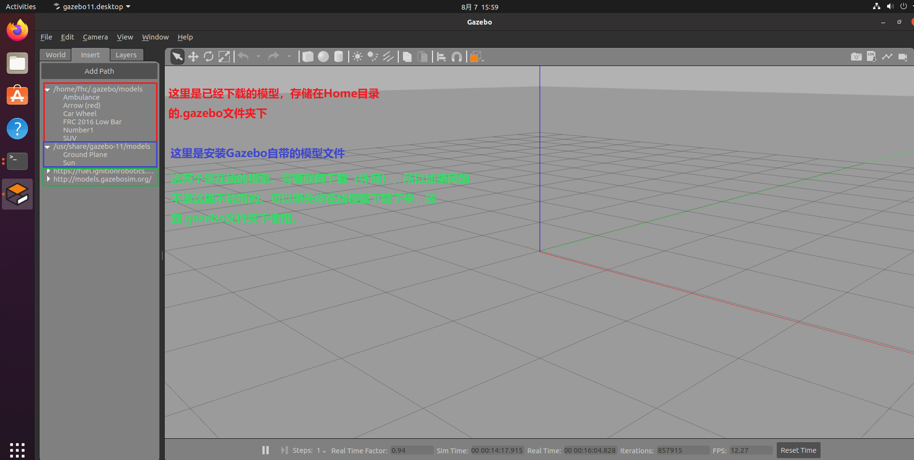

# Gazebo Getting Start

!!! Warning
    建议使用真机Ubuntu系统环境，虚拟机对图形系统和显卡的支持似乎不太好。

Gazebo是一款流行的机器人仿真软件，通常与ROS和Moveit搭配使用，Gazebo11（2019-01-30）是Classic Gazebo的最终版，之后Gazebo仿真团队将会集中精力去开发下一代的仿真软件：Ignition Gazebo。

现在的[Gazebo官网](https://gazebosim.org/)默认显示的就是Ignition Gazebo，如果按照官网教程安装的话，安装的就是Ignition Gazebo，然而目前（2022-08-07）网上流传的资料主要是针对Classic Gazebo，所以初学者要明白这一点。

Classic Gazebo的访问地址：[http://classic.gazebosim.org/](http://classic.gazebosim.org/)


## 1. Ignition Gazebo

简单试用了一下Ignition Gazebo，使用VMware16 + Ubuntu20.04，[安装方法参照官网教程](https://gazebosim.org/docs/fortress/install_ubuntu)（Ignition Gazebo最新版本仅支持从源码编译安装，比较麻烦，所以这里选择安装最新的LTS版本Ignition-Fortress），但是Ignition Gazebo启动后仿真界面（就是现实三维物体的界面）黑屏。

原因是虚拟机对OpenGL和显卡的支持不完善导致的，最终强制使用ogre渲染引擎启动才正常（默认应该是ogre2）：

```
ign gazebo shapes.sdf -v 4 -render-engine ogre
```

但是刷新速度很慢，大约1秒刷一次，就是那个仿真界面一直在闪烁，没法使用，由于暂时没有Ubuntu真机，所以暂时放弃使用Ignition Gazebo，转投Classic Gazebo。

## 2. Classic Gazebo11

Gazebo11在虚拟机使用需要首先关掉虚拟机的“显示器3D加速功能”，建议使用真机Ubuntu系统。




安装可以参照官方教程，也可以直接使用命令安装：

```
sudo apt-get install gazebo11
```

安装后在终端执行gazebo命令即可启动：

```
gazebo
```



具体怎么使用可以先参考官网教程。

关于模型下载问题，如果网络不好。可以事先将模型下载下来，放到.gazebo文件夹下就好了：



在线模型地址：
* https://fuel.ignitionrobotics.org/ （通过浏览器无法访问）
* [http://models.gazebosim.org/](http://models.gazebosim.org/)

上面两个是Gazebo自带的。

* http://models.gazebosim.org/与[https://github.com/osrf/gazebo_models](https://github.com/osrf/gazebo_models)相同

* [https://app.gazebosim.org/dashboard](https://app.gazebosim.org/dashboard)可以在线下载模型