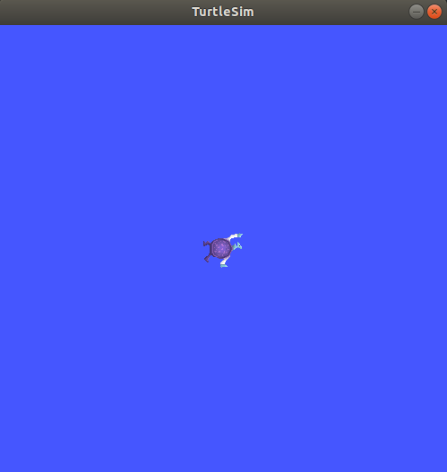

# ROS入门教程

[ROS参考官方教程](https://docs.ros.org/en/foxy/Tutorials.html)，下面的是笔者自己的学习记录。

!!! Note 
本文使用的ROS版本是foxy，Ubuntu版本是20.04，foxy是ROS的LTS版本性能稳定，太新的版本可能会出现意想不到的问题。

## 1. 安装ROS

请参考：

* [Moveit Getting Start - web](../moveit/moveit_getting_start.md) 
* [Moveit Getting Start - B站](https://www.bilibili.com/video/BV1fT4y1z7fG/)

## 2. 配置ROS2环境变量

```
source /opt/ros/foxy/setup.bash
```

## 3. 安装turtlesim

对于ROS来说turtlesim是一个非常简单的仿真，但是使用它足以向初学者说明ROS底层的运行机制（nodes, topic, services），所以turtlesim通常是ROS入门的第一课。

```
sudo apt update

sudo apt install ros-foxy-turtlesim
```

* 检查下turtlesim包的安装情况

```
ros2 pkg executables turtlesim
```

如果安装正确，将会返回如下列表：

```
turtlesim draw_square
turtlesim mimic
turtlesim turtle_teleop_key
turtlesim turtlesim_node
```

## 4. 启动turtlesim

```
ros2 run turtlesim turtlesim_node
```



同时在命令行中会打印出如下信息：

```
# turtlesim_node是ROS的一个node（节点）
[INFO] [turtlesim]: Starting turtlesim with node name /turtlesim

[INFO] [turtlesim]: Spawning turtle [turtle1] at x=[5.544445], y=[5.544445], theta=[0.000000]
```

在turtlesim_node中可以生成多只乌龟，启动turtlesim的同时将会自动生成一只乌龟，从上面命令行信息可以看出默认生成的乌龟的名字是turtle1。

## 5. 使用turtlesim

* turtlesim_node其实是ROS的一个节点，该节点可以控制乌龟移动

* 在这里我们启动另一节点turtle_teleop_key，该节点能够接受键盘(Arrow Keys)信息，并将该信息发送给turtlesim节点

```
# 启动后使用“上 下 左 右”键即可控制乌龟移动
ros2 run turtlesim turtle_teleop_key
```

* turtlesim_node节点接收到按键信息后就会执行相应的动作


使用下面的命令，可以查看节点机器相关的服务，话题，行为等信息：

```
ros2 node list
ros2 topic list
ros2 service list
ros2 action list
```

## 6. 安装rqt

rqt是ROS2的一个GUI工具，rqt提供能做的事情在命令行中都能做，但是rqt提供的更友好的图形化操作方式。

```
sudo apt update

sudo apt install ~nros-foxy-rqt*
```

## 7. 使用rqt

### 7.1 运行rqt

在命令行使用rqt命令，即可运行rqt：

```
rqt
```

* 首次启动rqt，rqt的窗口将是空白的


* 在rqt顶部菜单选择 Plugins > Services > Service Caller


点击service对应的下三角将可以看到turtlesim node的所有服务，如果没有显示完整的服务列表，请点击重载（reload）按钮。

### 7.2 尝试spawn服务

调用spawn服务将会在turtlesim中新生成一个乌龟。


* x,y指的是新生成乌龟的坐标位置
* name string指的是新生成乌龟的名字
* turtlesim默认生成的乌龟名字是turtle1
* 名字不能重复，所以这里我们取名为turtle2

参数设置好之后，点击Call按钮，你将会看到在turtlesim界面中新生成了一只乌龟turtle2。


### 7.3 使用set_pen服务

小乌龟在移动的同时会绘制出移动轨迹，set_pen服务就是用来设置该轨迹的画笔的参数，比如画笔的颜色、粗细等。


如上图所示，我们来设置turtle1的画笔为纯红色，宽度为5，然后点击Call按钮，然后当我们再次移动turtle1时，将会绘制出红色宽度5的轨迹线。


## 8. Remapping（重映射）

上面我们使用rqt的spawn服务新生成了一只乌龟turtle2，那么如何去控制turtle2呢？

使用ROS Remapping机制，将原来发送给turtle1的指令信息全都重映射给turtle2，然后就可以使用键盘（Arrow keys）去控制turtle2了。具体操作如下：

* 首先重新启动一个终端（记得设置ROS环境变量）

* Remapping

```
ros2 run turtlesim turtle_teleop_key --ros-args --remap turtle1/cmd_vel:=turtle2/cmd_vel
```

* 现在就可以使用键盘（Arrow keys）去控制turtle2了

