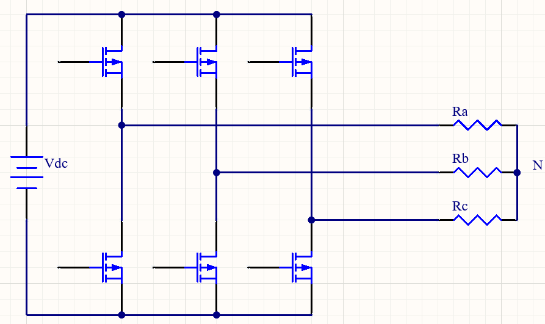
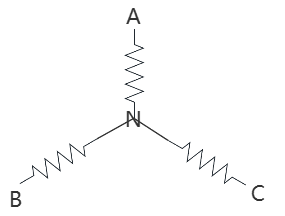

$$

V_{NB}=V_{NC}=\frac{1}{3}V_{DC}

\\

V_{BN}=V_{CN}=-\frac{1}{3}V_{DC}

\\

V_{AN}=\frac{2}{3}V_{DC}

$$

|$S_a$|$S_b$|$S_c$|Vector|V_{AN}|V_{BN}|V_{CN}|
|-----|-----|-----|------|------|------|------|
|0|0|0|Vx|
|0|0|1|Vx|$-\frac{1}{3}V_{DC}$|$-\frac{1}{3}V_{DC}$|$\frac{2}{3}V_{DC}$|
|0|1|0|Vx|$-\frac{1}{3}V_{DC}$|$-\frac{1}{3}V_{DC}$|$\frac{2}{3}V_{DC}$|
|0|1|1|
|1|0|0|
|1|0|1|
|1|1|0|
|1|1|1|

