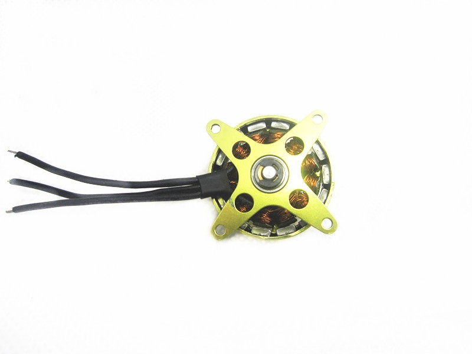
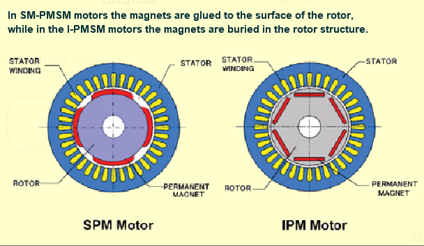

# ST电机开发套件P-NUCLEO_IHM001 Getting Start

[Board Configuration](html/ST%20Motor%20Profiler%20Board%20Configuration.html)

## 1. 硬件基本情况

[P-NUCLEO_IHM001](https://www.stmicroelectronics.com.cn/en/evaluation-tools/p-nucleo-ihm001.html#)

Three-phase motor Bull-Running model BR2804-1700 kV：
* Magnetic Struct: SM-PMSM
* Pole Pairs: 7
* Max Speed: 12540rpm
* Nominal Volatge: 11.1V
* Max DC Current: 5A

## 2. SM-PMSM vs IM-PMSM

* SM: surface permanenr magnet  表贴永磁体
* IM: interior permanent magnet 内嵌永磁体

SM-PMSM与IM-PMSM的区别就在于转子上的永磁体是表贴的还是内嵌的，如下图：

