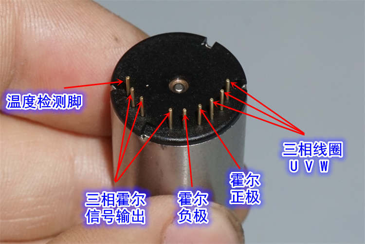
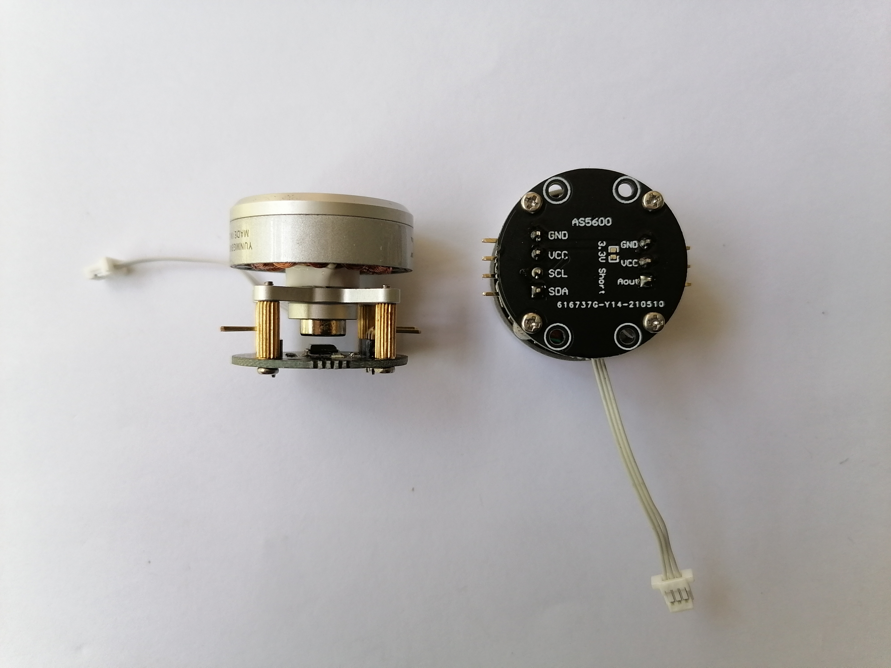
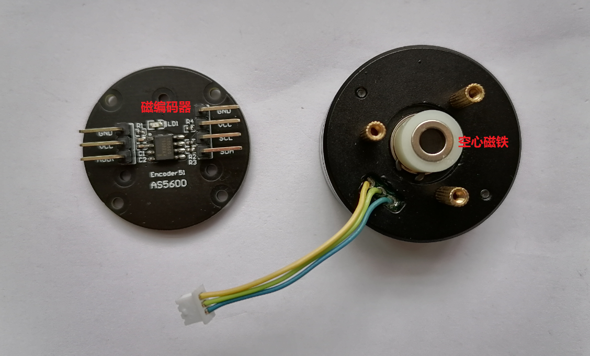

# 无刷电机

## 1.无刷电机简介

无刷电机没有电刷，分为带霍尔传感器的和不带霍尔传感器的，这里的霍尔传感器主要用来定位转子的位置。

* 无感无刷电机通常只有U V W三条线
* 有感无刷电机除了U V W三条线外，还有Ha Hb Hc VCC GND五条线，Ha Hb Hc是三个霍尔传感器的输出，VCC和GND是霍尔传感器的电源

也可以使用磁编码器代替霍尔传感器，实现更高精度的位置控制，目前高精度伺服电机都是使用的磁编码器。

## 2.无刷电机常用的驱动方法

* 6步法，比较简单，但是性能没有FOC好
* FOC，很多使用DRV8301的方案

## 3.无刷电机驱动IC简介
* [DRV11873无感6步法-只能旋转调速不能换向](https://www.ti.com/product/DRV11873)
* [DRV10974正弦波控制-无感-速度反馈-正反转-调速](https://www.ti.com/product/DRV10974)
* [DRV10987](https://www.ti.com/product/DRV10987)

* TI MCF8316A集成无感FOC
* [MCF8316A 40-V max, 8-A peak, sensorless FOC control 3-phase BLDC motor driver](https://www.ti.com/product/MCF8316A)

* [淘宝DRV11873](https://detail.tmall.com/item.htm?spm=a230r.1.14.8.19465899HrcncU&id=604320055041&cm_id=140105335569ed55e27b&abbucket=14)

## 4.无刷电机学习资源
* [Matlab无刷直流电机控制简介](https://ww2.mathworks.cn/campaigns/offers/brushless-dc-motors-introduction.html)
* [ODrive](https://odriverobotics.com/)
* [SimpleFOC](https://github.com/simplefoc)

* [淘宝上也有卖带驱动器的无刷电机](https://item.taobao.com/item.htm?spm=a230r.1.14.35.7466181a9zKHSn&id=532666126398&ns=1&abbucket=14#detail)

## 5.无感无刷电机6步法介绍

* [无感无刷电机6步法](http://www.elecfans.com/kongzhijishu/sifuyukongzhi/1293967.html)

无刷无感直流电机多通过反电势来判断转子位置，但在电机转速为零或很低的情况下，检测不到反电势，必须让电机加速到一定速度才可以通过反电动势检测转子位置。通常用三段式启动法，包括三个步骤：预定位、加速、切换。

预定位：刚开始的时候转子位置是未知的，而启动前需要准确知道转子位置，因此给电机任意二相通电，把电机转子固定到一个已知位置。例如先给AB通电，再给BC通电，给二相通电比起给一相通电的好处是，避免了转子正好与通电相成90度而不能把转子拉到预定位置。

加速：加速的方法有恒频升压法、恒压升频法、升压升频法。常用的方法是恒频升压法：通过不断改变占空比和换相时间来使转子加速

切换：转速达到一定值，可以检测到反电动势的时候，就可以通过切换到正常运行状态，选择切换的方法通常有：

1.可以检测到电机转速，达到预定转速切换；

2.设定一个加速时间，超过加速时间后切换；

3.检测到一定次数的反电动势后切换。

二．换相时间

换相时间影响到电机的效率，理论上的最佳换相时间是检测到过零点后30度电角度，但过零点后30度电角度准确时间是多长却是难以知道的，只能通过前几次换相时间来进行推断，推断总会有误差，且程序的执行也是需要时间，因此最佳换相时间算法成了一个关注点。在一些算法中，选择检测到过零点后立即换相，在高速的情况下电机效率损失很小。

三．闭环控制执行时间

大多数的应用下用开环控制就足以应付，如无人机，然而需要精确速度控制的情况下，需要加入PID闭环控制，常用的有转速单闭环控制、转速电流双闭环控制，在双闭环控制中，通常内环运行频率高于外环运行频率。