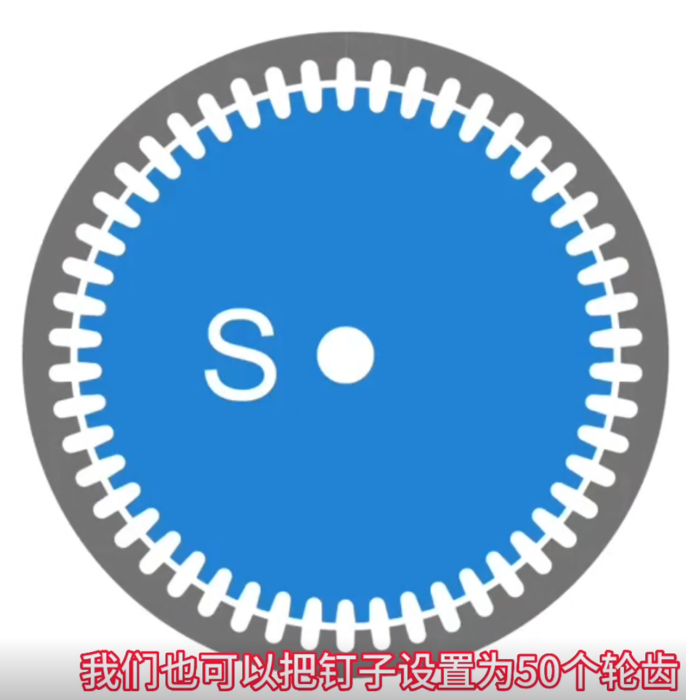
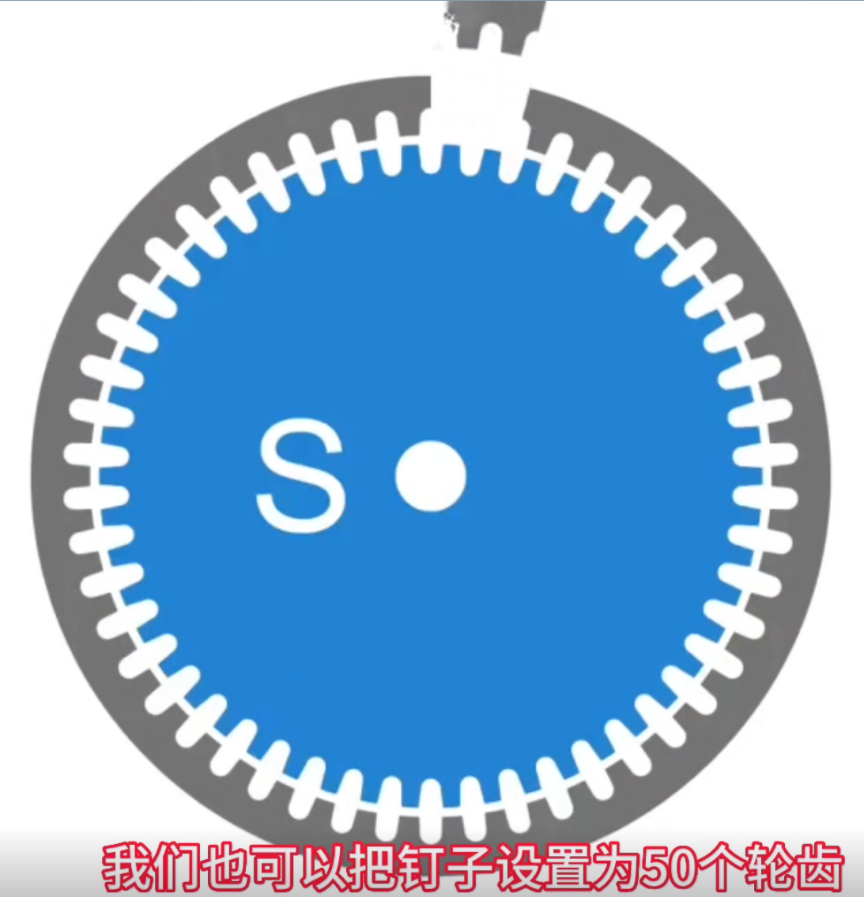
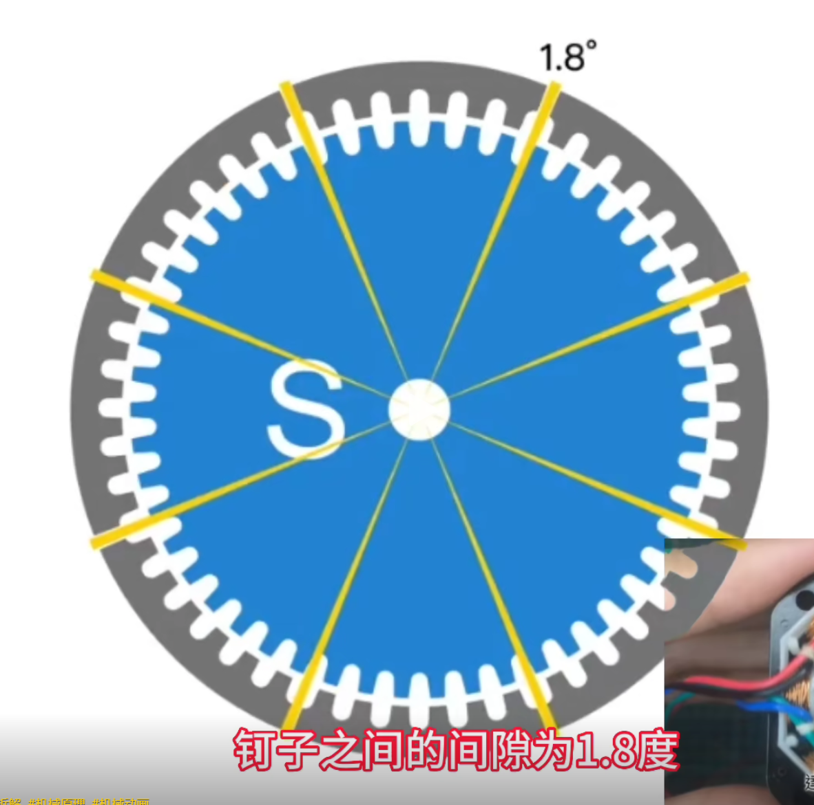
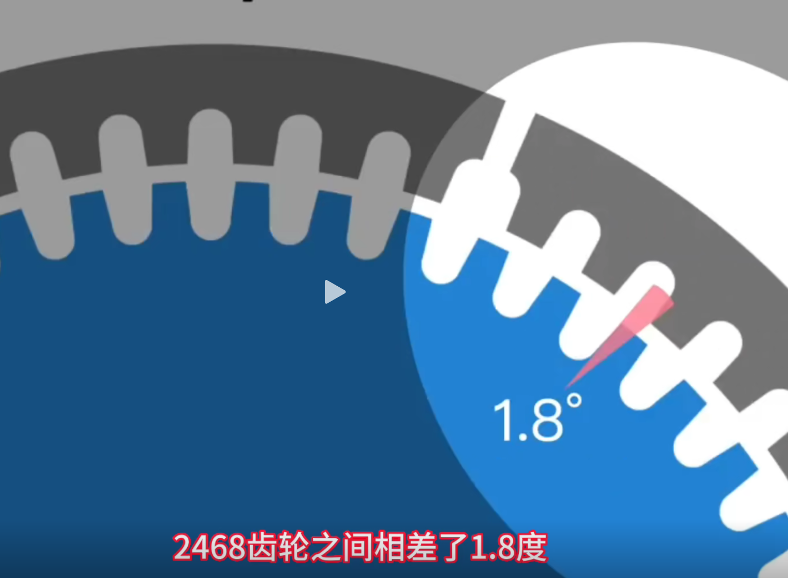
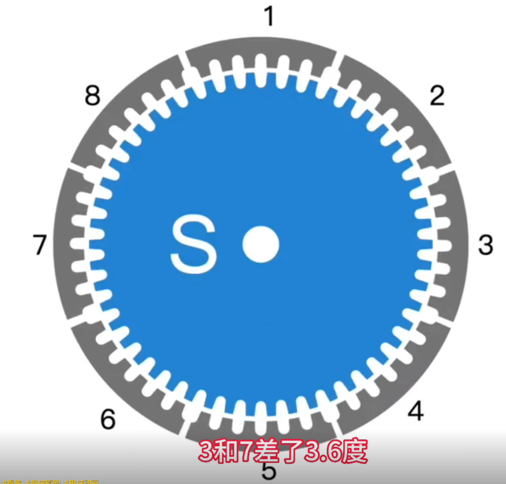
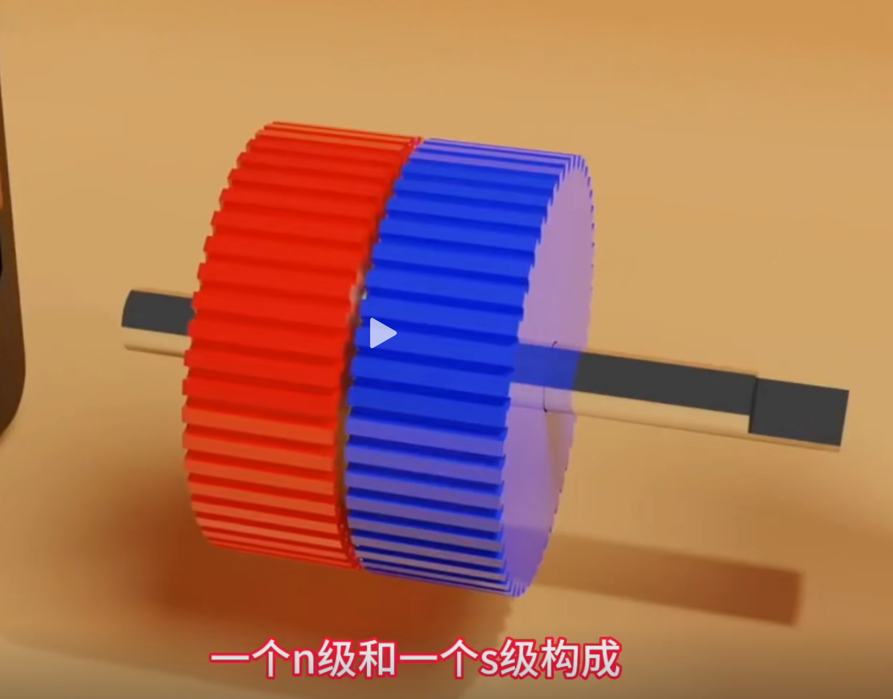
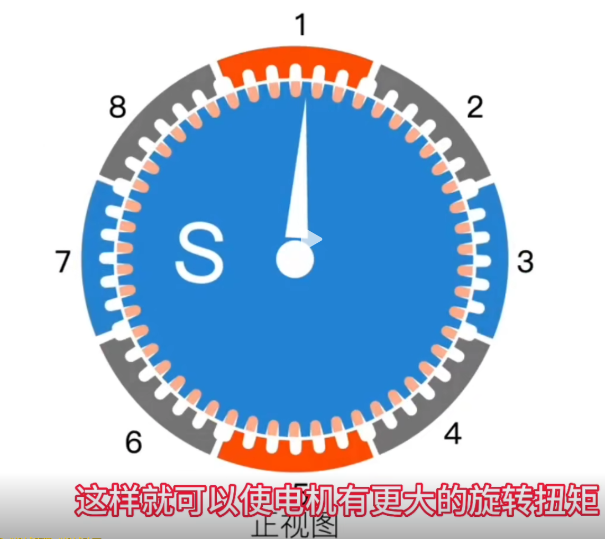

* 50个齿，齿间距为360/50=7.2
* 去掉2个齿也就是减少了7.2*2=14.4°
* 剩下的平均分成8组，有8个相等的间隙，这些间隙就是移去的14.4°，所以每个间隙为14.4/8=1.8°
* 该步进电机转动的时候，每次转动1.8°后就会有一组内外齿对齐，所以步距角就是1.8°

定子的第3组和第7组与转子的齿相差是3.6°

转子其实是由两个磁极构成，两个磁极的齿相差3.6°

所以当转子的S极与定子的第1组和第5组对齐时，转子的N极就会与定子的第3组和第7组对齐，增加电机的扭矩

[点击查看视频说明]( https://v.douyin.com/CeiJQkq8V/)

