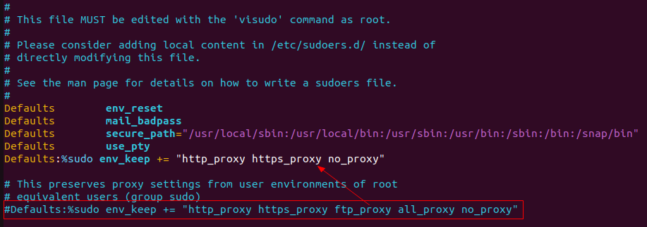

# Moveit Getting Start

* [Moveit Tutorials on Office Site](https://moveit.picknik.ai/galactic/doc/tutorials/getting_started/getting_started.html)

## 0. 准备

### 0.1 更改Ubuntu软件源，加快apt-get软件下载速度

[点击查看设置方法](../../Embedded%20System/linux/embedded_linux_dev_env/ubuntu_change_sw_source.md)

### 0.2 科学上网

* 赛风 -> 设置 -> 本地代理端口 -> HTTP/HTTPS(1080),允许网络下的其他设备使用该代理

```
export http_proxy="http://pc_ip:1080" 
export https_proxy="http://pc_ip:1080" 
```

* 在/etc/sudoers文件中添加如下内容，使sudo命令也能科学上网：

```
sudo chmod +w /etc/sudoers
sudo vim /etc/sudoers

# add
Defaults:%sudo env_keep += "http_proxy https_proxy no_proxy"
```



## 1. 使用Debian Packages安装ROS

> 注意：ROS对Ubuntu系统的版本是有要求的，比如最新的ROS 2 Galactic Geochelone要求的Ubuntu版本是Ubuntu Linux - Focal Fossa (20.04)，最好是按照ROS官方要求的版本进行安装，否则可能会出现各种奇怪问题。

* ROS可以通过官方预编译的二进制安装包安装，也可以通过源码编译安装
* 一般支持AMD64、ARM64和ARM32架构
* [The target platforms ](https://github.com/ros-infrastructure/rep/blob/master/rep-2000.rst)

* [ROS Tutorials](https://docs.ros.org/en/galactic/Installation.html)

### 1.1 Set locale(Make sure you have a locale which supports UTF-8)

```
locale  # check for UTF-8

sudo apt update && sudo apt install locales
sudo locale-gen en_US en_US.UTF-8
sudo update-locale LC_ALL=en_US.UTF-8 LANG=en_US.UTF-8
export LANG=en_US.UTF-8

locale  # verify settings
```

### 1.2 设置ROS软件源

为了使用apt命令安装ROS，需要将ROS 2 apt仓库添加到系统软件源中。首先确定Ubuntu Universe repository在你的系统中是使能的。

```
apt-cache policy | grep universe

# will output
 500 http://us.archive.ubuntu.com/ubuntu focal/universe amd64 Packages
     release v=20.04,o=Ubuntu,a=focal,n=focal,l=Ubuntu,c=universe,b=amd64
```

如果你没有看到上面的输出，那么请执行如下命令来使能Ubuntu Universe repository。

```
sudo apt install software-properties-common
sudo add-apt-repository universe
```

添加ROS 2 apt仓库到系统软件源中。

```

# authorize GPG key with apt
sudo apt update && sudo apt install curl gnupg lsb-release

# 这一步是从github下载ros.key，并重命名为ros-archieve-keyring.gpg放到 /usr/share/keyrings/ 目录下
# 可以自己从浏览器下载ros.key
sudo curl -sSL https://raw.githubusercontent.com/ros/rosdistro/master/ros.key -o /usr/share/keyrings/ros-archive-keyring.gpg

# add the repository to your sources list
echo "deb [arch=$(dpkg --print-architecture) signed-by=/usr/share/keyrings/ros-archive-keyring.gpg] http://packages.ros.org/ros2/ubuntu $(source /etc/os-release && echo $UBUNTU_CODENAME) main" | sudo tee /etc/apt/sources.list.d/ros2.list > /dev/null
```

### 1.3 安装ROS 2 Packages

```
sudo apt update
sudo apt install ros-galactic-desktop
sudo apt install ros-galactic-ros-base
```

### 1.4 环境变量设置

```
source /opt/ros/galactic/setup.bash
```

### 1.5 尝试运行一个例子来验证ROS 2环境的正确性

* 首先在一个终端中，设置环境变量并运行一个C++ talker（话题发布者）
```
source /opt/ros/galactic/setup.bash
ros2 run demo_nodes_cpp talker
```

* 然后在另一个终端中，设置环境变量并运行一个Python listener（话题订阅者）

```
source /opt/ros/galactic/setup.bash
ros2 run demo_nodes_py listener
```

## 2. Moveit Demo工程设置

### 2.1 安装rosdep

rosdep是一个软件依赖包安装工具，后续将使用rosdep安装ROS依赖软件包。

```
sudo apt install python3-rosdep
```

### 2.2 更新软件源

```
sudo rosdep init
rosdep update
sudo apt update
sudo apt dist-upgrade
```

### 2.3 安装ROS 2构建系统Colcon mixin

```
sudo apt install python3-colcon-common-extensions
sudo apt install python3-colcon-mixin
colcon mixin add default https://raw.githubusercontent.com/colcon/colcon-mixin-repository/master/index.yaml
colcon mixin update default
```

### 2.4 安装vcstool

Vcstool is a version control system (VCS) tool, designed to make working with multiple repositories easier.

```
sudo apt install python3-vcstool
```

### 2.5 创建一个Colcon Workspace并下载Moveit教程

* 创建Colcon Workspace
```
mkdir -p ~/ws_moveit2/src
```

* 下载Moveit教程
```
cd ~/ws_moveit2/src
git clone https://github.com/ros-planning/moveit2_tutorials.git
vcs import < moveit2_tutorials/moveit2_tutorials.repos
```

### 2.6 构建你的Colcon Workspace


* 安装所需的软件依赖包（包括moveit和moveit的依赖）
```
rosdep install -r --from-paths . --ignore-src --rosdistro $ROS_DISTRO -y
```

* 配置Colcon Workspace

```
cd ~/ws_moveit2
colcon build --mixin release
```

如果遇到如下编译错误（2022-05）：

[has no member named ‘future’ when building moveit2_tutorials ](https://github.com/ros-planning/moveit2_tutorials/issues/350)

```
Finished <<< launch_param_builder [3.20s]
--- stderr: moveit2_tutorials                             
/home/fernando/ws_moveit2/src/moveit2_tutorials/doc/examples/planning_scene_ros_api/src/planning_scene_ros_api_tutorial.cpp: In function ‘int main(int, char**)’:
/home/fernando/ws_moveit2/src/moveit2_tutorials/doc/examples/planning_scene_ros_api/src/planning_scene_ros_api_tutorial.cpp:164:77: error: ‘using SharedFuture = class std::shared_future<std::shared_ptr<moveit_msgs::srv::ApplyPlanningScene_Response_<std::allocator<void> > > >’ {aka ‘class std::shared_future<std::shared_ptr<moveit_msgs::srv::ApplyPlanningScene_Response_<std::allocator<void> > > >’} has no member named ‘future’
  164 |   response_future = planning_scene_diff_client->async_send_request(request).future.share();
      |                                                                             ^~~~~~
make[2]: *** [doc/examples/planning_scene_ros_api/CMakeFiles/planning_scene_ros_api_tutorial.dir/build.make:63: doc/examples/planning_scene_ros_api/CMakeFiles/planning_scene_ros_api_tutorial.dir/src/planning_scene_ros_api_tutorial.cpp.o] Error 1
make[1]: *** [CMakeFiles/Makefile2:380: doc/examples/planning_scene_ros_api/CMakeFiles/planning_scene_ros_api_tutorial.dir/all] Error 2
make: *** [Makefile:141: all] Error 2
---
Failed   <<< moveit2_tutorials [6.32s, exited with code 2]
```

解决方法如下：

[](https://github.com/ros-planning/moveit2_tutorials/pull/198/files/3f80be1144b62d7616dfe8c01c0856ae65e7c20c)

* doc/examples/planning_scene_ros_api/src/planning_scene_ros_api_tutorial.cpp 第164行，修改如下：

```
response_future = planning_scene_diff_client->async_send_request(request);
```

> 注意：切换到galactic分支也不行，没有深究其原因

* 设置环境变量

```
source ~/ws_moveit2/install/setup.bash
```

## 3. 使用RViz可视化机器人模型

### 3.1 启动Demo

```
ros2 launch moveit2_tutorials demo.launch.py rviz_tutorial:=true
```

* 该Demo启动后，你将在RViz中看到一个空的世界


* 点击Add按钮，添加“MotionPlanning” 作为显示类型


* 现在你会在RViz中看到 Panda robot


## 3.2 检查如下几个参数的设置

* Displays -> Global Options -> Fixed Frame: /panda_link0
* MotionPlanning -> Robot Description: robot_description
* MotionPlanning -> Planning Scene Topic: /monitored_planning_scene
* MotionPlanning -> Planned Path -> Trajectory Topic: /display_planned_path

以上四个参数一般是默认值，下面这些参数一般需要手动修改下：

* MotionPlanning -> Planning Request -> Planning Group: panda_arm

* 取消选择 MotionPlanning -> Scene Robot -> Show Robot Visual（不显示机械臂本体）
* 选中MotionPlanning -> Planning Request -> Query Start State（机械臂的起始姿态-A点）
* 选中MotionPlanning -> Planning Request -> Query Goal State（机械臂的目标姿态-B点）
* 修改值MotionPlanning -> Planning Path -> State Display Time: 0.05s（这个是仿真执行的速度，速度太快不便于观察，故修改为0.05s）
* 选中MotionPlanning -> Planning Path -> Loop Animation（循环播放仿真过程）
* 选中MotionPlanning -> Planning Path -> Show Trail（显示A到B之间的轨迹点）

如上参数设置完毕后，点击Plan即可看见仿真结果。