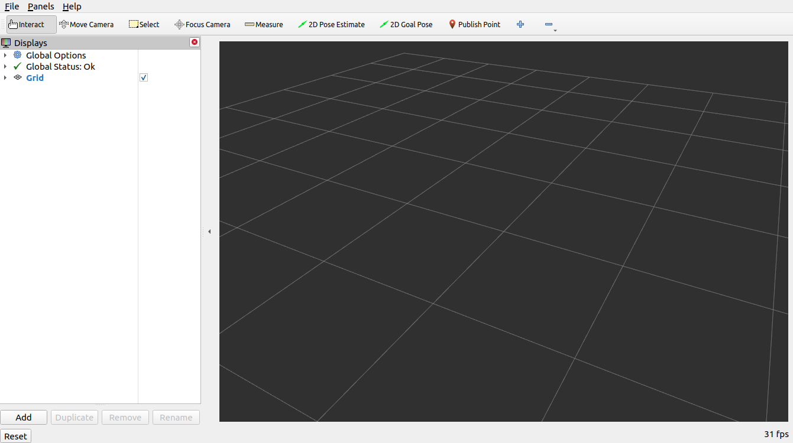

# Moveit Getting Start

* [Moveit Tutorials](https://moveit.picknik.ai/galactic/doc/tutorials/getting_started/getting_started.html)

## 1. 使用Debian Packages安装ROS

* ROS可以通过官方预编译的二进制安装包安装，也可以通过源码编译安装
* 一般支持AMD64、ARM64和ARM32架构
* [The target platforms ](https://github.com/ros-infrastructure/rep/blob/master/rep-2000.rst)

* [ROS Tutorials](https://docs.ros.org/en/galactic/Installation.html)

### 1.1 Set locale(Make sure you have a locale which supports UTF-8)

```
locale  # check for UTF-8

sudo apt update && sudo apt install locales
sudo locale-gen en_US en_US.UTF-8
sudo update-locale LC_ALL=en_US.UTF-8 LANG=en_US.UTF-8
export LANG=en_US.UTF-8

locale  # verify settings
```

### 1.2 设置ROS软件源

为了使用apt命令安装ROS，需要将ROS 2 apt仓库添加到系统软件源中。首先确定Ubuntu Universe repository在你的系统中是使能的。

```
apt-cache policy | grep universe
 500 http://us.archive.ubuntu.com/ubuntu focal/universe amd64 Packages
     release v=20.04,o=Ubuntu,a=focal,n=focal,l=Ubuntu,c=universe,b=amd64
```

如果你没有看到上面的输出，那么请执行如下命令来使能Ubuntu Universe repository。

```
sudo apt install software-properties-common
sudo add-apt-repository universe
```

添加ROS 2 apt仓库到系统软件源中。

```

# authorize GPG key with apt
sudo apt update && sudo apt install curl gnupg lsb-release
sudo curl -sSL https://raw.githubusercontent.com/ros/rosdistro/master/ros.key -o /usr/share/keyrings/ros-archive-keyring.gpg

# add the repository to your sources list
echo "deb [arch=$(dpkg --print-architecture) signed-by=/usr/share/keyrings/ros-archive-keyring.gpg] http://packages.ros.org/ros2/ubuntu $(source /etc/os-release && echo $UBUNTU_CODENAME) main" | sudo tee /etc/apt/sources.list.d/ros2.list > /dev/null
```

### 1.3 安装ROS 2 Packages

```
sudo apt update
sudo apt install ros-galactic-desktop
sudo apt install ros-galactic-ros-base
```

### 1.4 环境变量设置

```
source /opt/ros/galactic/setup.bash
```

### 1.5 尝试运行一个例子来验证ROS 2环境的正确性

* 首先在一个终端中，设置环境变量并运行一个C++ talker（话题发布者）
```
source /opt/ros/galactic/setup.bash
ros2 run demo_nodes_cpp talker
```

* 然后在另一个终端中，设置环境变量并运行一个Python listener（话题订阅者）

```
source /opt/ros/galactic/setup.bash
ros2 run demo_nodes_py listener
```

## 2. Moveit Demo工程设置

### 2.1 安装rosdep

rosdep是一个软件依赖包安装工具，后续将使用rosdep安装ROS依赖软件包。

```
sudo apt install python3-rosdep
```

### 2.2 更新软件源

```
sudo rosdep init
rosdep update
sudo apt update
sudo apt dist-upgrade
```

### 2.3 安装ROS 2构建系统Colcon mixin

```
sudo apt install python3-colcon-common-extensions
sudo apt install python3-colcon-mixin
colcon mixin add default https://raw.githubusercontent.com/colcon/colcon-mixin-repository/master/index.yaml
colcon mixin update default
```

### 2.4 安装vcstool

Vcstool is a version control system (VCS) tool, designed to make working with multiple repositories easier.

```
sudo apt install python3-vcstool
```

### 2.5 创建一个Colcon Workspace并下载Moveit教程

* 创建Colcon Workspace
```
mkdir -p ~/ws_moveit2/src
```

* 下载Moveit教程
```
cd ~/ws_moveit2/src
git clone https://github.com/ros-planning/moveit2_tutorials.git
vcs import < moveit2_tutorials/moveit2_tutorials.repos
```

### 2.6 构建你的Colcon Workspace


* 安装所需的软件依赖包（包括moveit和moveit的依赖）
```
rosdep install -r --from-paths . --ignore-src --rosdistro $ROS_DISTRO -y
```

* 配置Colcon Workspace

```
cd ~/ws_moveit2
colcon build --mixin release
```

* 设置环境变量

```
source ~/ws_moveit2/install/setup.bash
```

## 3. 使用RViz可视化机器人模型

### 3.1 启动Demo

```
ros2 launch moveit2_tutorials demo.launch.py rviz_tutorial:=true
```

* 该Demo启动后，你将在RViz中看到一个空的世界


* 点击Add按钮，添加“MotionPlanning” 作为显示类型


* 现在你会在RViz中看到 Panda robot

