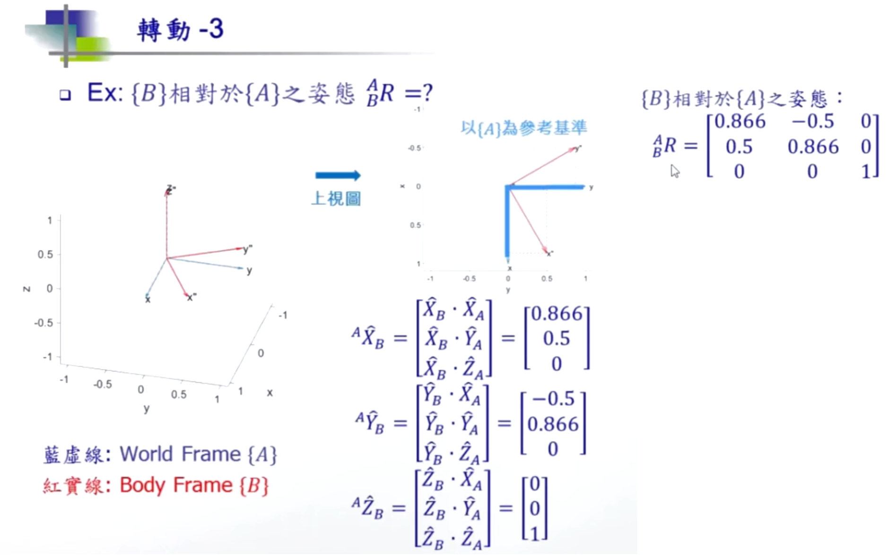
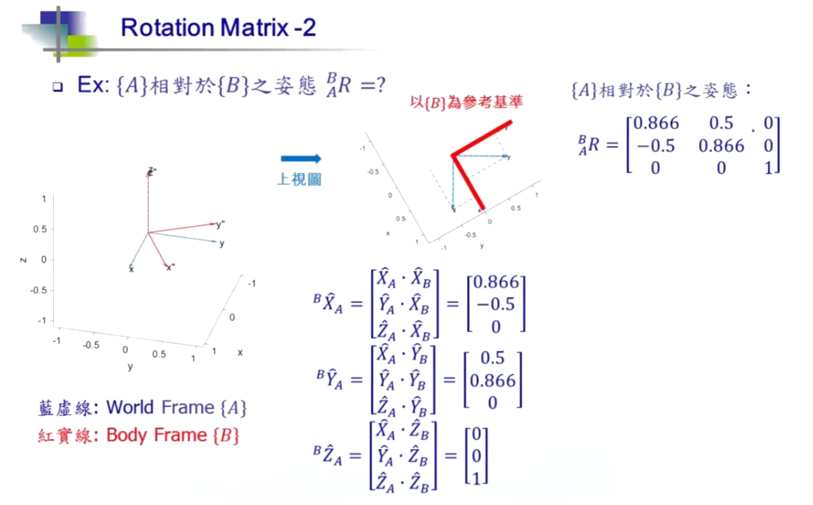
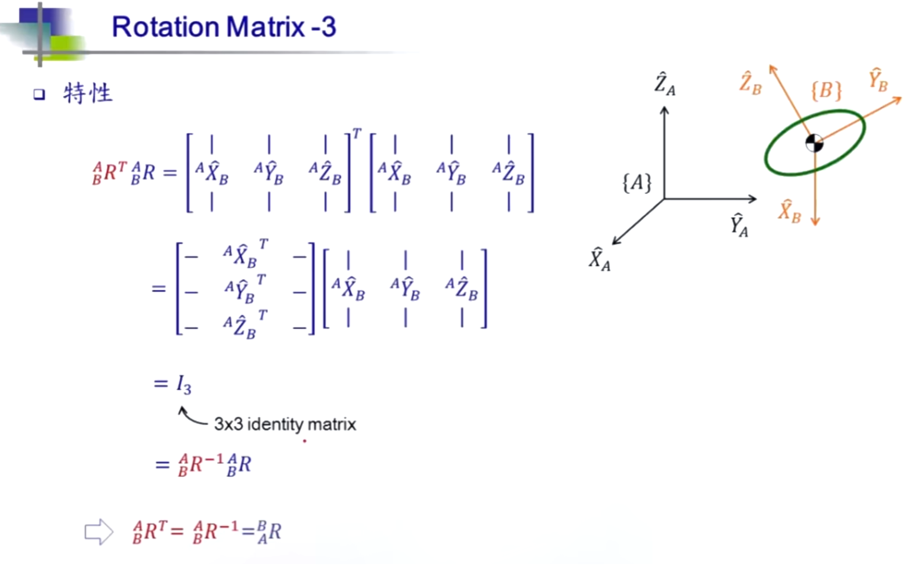
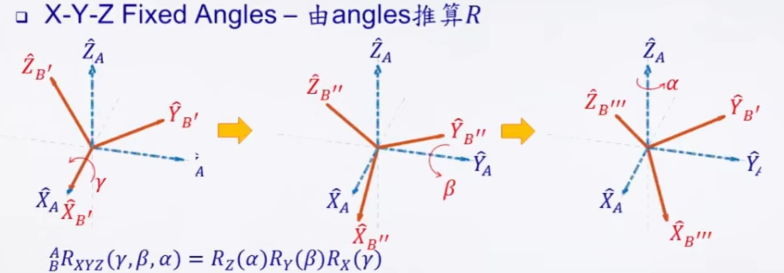
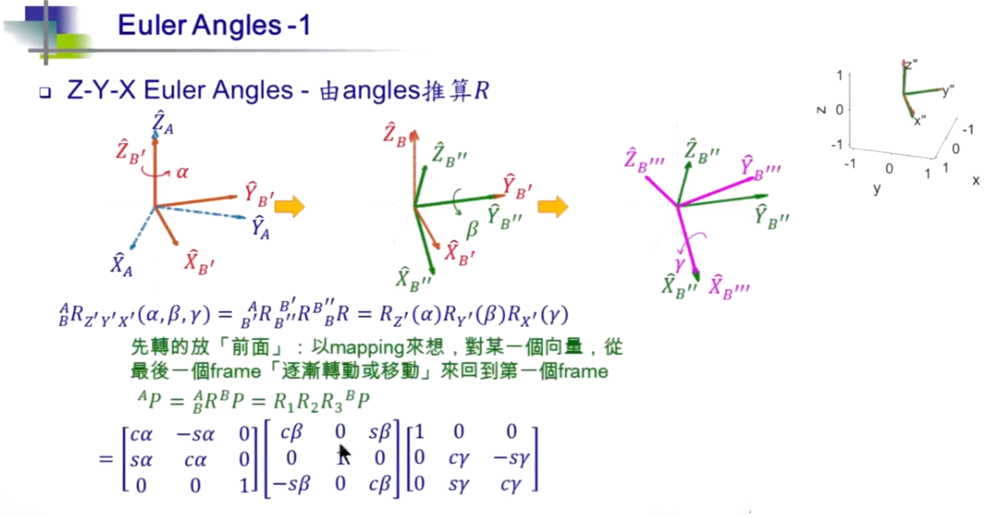

## 1. $^A_BR=^B_AR^T$

### B在A中的姿态

$$
^A\widehat{X}_B=

\begin{bmatrix}
    0.886 \\
    0.5 \\
    0 \\
\end{bmatrix}

^A\widehat{Y}_B=

\begin{bmatrix}
    -0.5 \\
    0.886 \\
    0 \\
\end{bmatrix}

^A\widehat{Z}_B=

\begin{bmatrix}
    0 \\
    0 \\
    1 \\
\end{bmatrix}

$$

$$
^A_BR=
\begin{bmatrix}
    0.886 & -0.5  & 0 \\
    0.5   & 0.886 & 0 \\
    0     & 0     & 1 \\
\end{bmatrix}
$$

### A在B中的姿态

$$
^B\widehat{X}_A=

\begin{bmatrix}
    0.886 \\
    -0.5 \\
    0 \\
\end{bmatrix}

^B\widehat{Y}_A=

\begin{bmatrix}
    0.5 \\
    0.886 \\
    0 \\
\end{bmatrix}

^B\widehat{Z}_A=

\begin{bmatrix}
    0 \\
    0 \\
    1 \\
\end{bmatrix}
$$

$$
^B_AR=
\begin{bmatrix}
    0.886 & 0.5  &0 \\
    -0.5 & 0.886 &0 \\
    0    & 0     &1 \\
\end{bmatrix}
$$

### B在A中的姿态与A在B中的姿态仅差一个转置

$$
^B_AR=
\begin{bmatrix}
    0.886 & 0.5  &0 \\
    -0.5 & 0.886 &0 \\
    0    & 0     &1 \\
\end{bmatrix}
=
^A_BR^T=
\begin{bmatrix}
    0.886 & 0.5  &0 \\
    -0.5 & 0.886 &0 \\
    0    & 0     &1 \\
\end{bmatrix}

$$

## 2. $^A_BR^T=^A_BR^{-1}$

### 一个旋转矩阵与其自身的转置相乘为一个单位矩阵

$$
^A_BR^T * ^A_BR=
\begin{bmatrix}
    0.886 & 0.5  &0 \\
    -0.5 & 0.886 &0 \\
    0    & 0     &1 \\
\end{bmatrix}
* 
\begin{bmatrix}
    0.886 & -0.5  & 0 \\
    0.5   & 0.886 & 0 \\
    0     & 0     & 1 \\
\end{bmatrix}
$$

$$
^A_BR^T * ^A_BR=
\begin{bmatrix}
    ^AX_B * X_A & ^AX_B * Y_A & ^AX_B * Z_A \\
    ^AY_B * X_A & ^AY_B * Y_A & ^AY_B * Z_A \\
    ^AZ_B * X_A & ^AZ_B * Y_A & ^AZ_B * Z_A \\
\end{bmatrix} 

* 

\begin{bmatrix}
    ^AX_B * X_A & ^AY_B * X_A & ^AZ_B * X_A \\
    ^AX_B * Y_A & ^AY_B * Y_A & ^AZ_B * Y_A \\
    ^AX_B * Z_A & ^AY_B * Z_A & ^AZ_B * Z_A \\
\end{bmatrix} 
$$

$$
=\begin{bmatrix}
    1 & 0 & 0 \\
    0 & 1 & 0 \\
    0 & 0 & 1 \\
\end{bmatrix} 
$$

* 旋转矩阵与其转置矩阵相乘为单位矩阵，即旋转矩阵的转置与旋转矩阵的逆矩阵相等

$$
^A_BR^T=^B_AR=^A_BR^{-1}
$$

## 3. fixed angles

$$

^A_BR_{XYZ}(\gamma,\beta,\alpha)=R_Z(\alpha)R_Y(\beta)R_X(\gamma)

$$

## 4. euler angles

