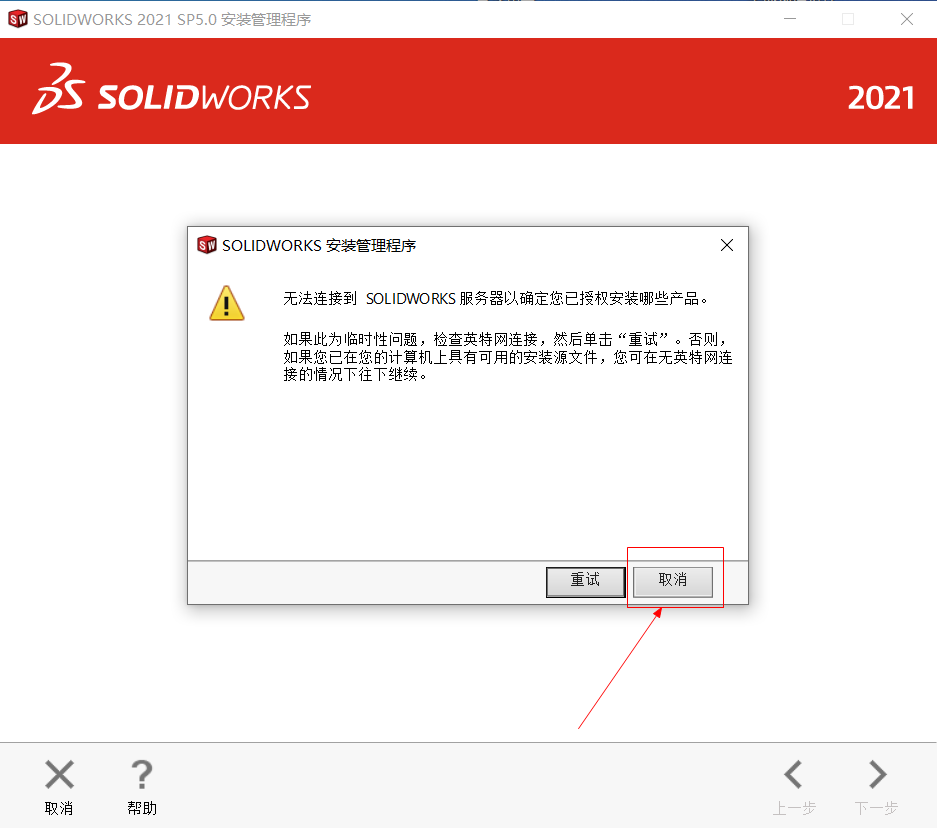
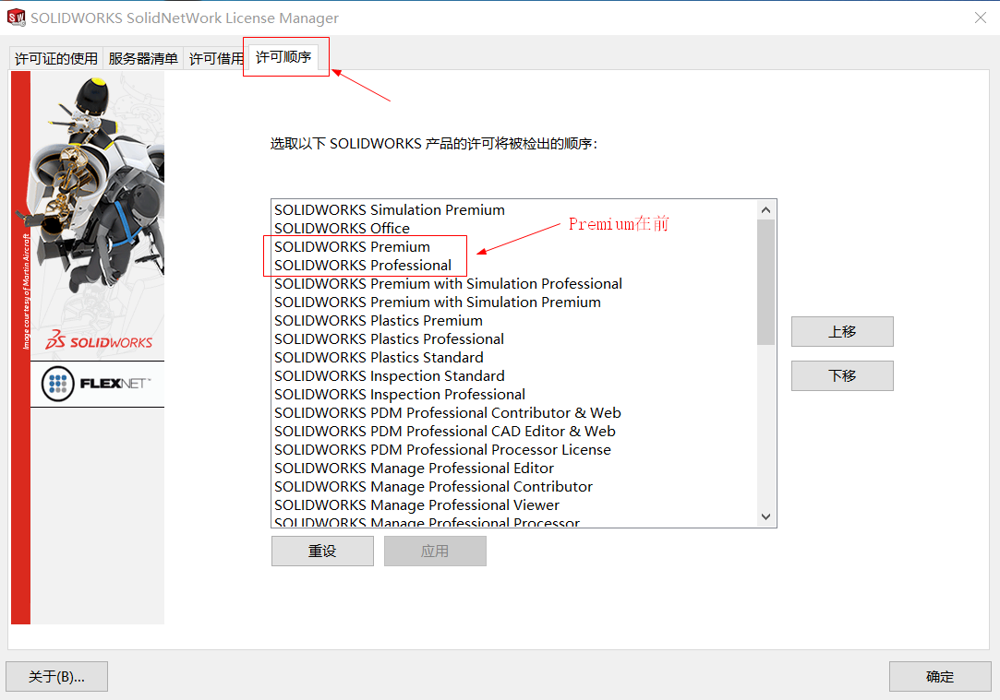

# Solidworks 2021安装

* [Solidworks 2021下载地址](https://pan.baidu.com/s/12-Z0IYnX2Vl124fqlIrV6g)
* 提取码：igt8
* 内有BT种子，如果百度云盘下载速度慢，可以使用BT种子迅雷下载

## 1. 安装文件说明


* _SolidQUAD是破解文件
* SolidWorks.2021.SP5.0.Full.Premium.DVD是安装文件

## 2. 安装步骤

> 注意：请断网安装

* 执行如下文件，这样在安装SolidWorks时就有序列号了

```
_SolidSQUAD_/_SolidSQUAD_/sw2021_network_serials_licensing.reg
```

* 将文件夹SolidWorks_Flexnet_Server复制到C盘（其他位置也可以，保证不被删除就行），并管理员身份运行：

```
_SolidSQUAD_/_SolidSQUAD_/SolidWorks_Flexnet_Server/server_install.bat
```

* 安装SolidWorks 2021

```
> 如果需要，包括PDM Client，请勿安装SolidNetwork许可服务器（SNL）！

> 当询问许可证服务器定义输入时：25734 @ localhost（一般默认就是这个，不用修改）

> 注意：要断网，无法联网警告时，选择“取消”

```




* 安装完成后，使用```SolidSQUAD_/_SolidSQUAD_/Program Files/SOLIDWORKS Corp``` 和 ```SolidSQUAD_/_SolidSQUAD_/Program Files(x86)```中的文件替换已安装的对应文件

```

> 注意：你不一定安装了所有的文件，只替换掉你有的即可

C：\ Program Files \ SOLIDWORKS Corp \ eDrawings
C：\ Program Files \ SOLIDWORKS Corp \ SOLIDWORKS
C：\ Program Files \ SOLIDWORKS Corp \ SOLIDWORKS CAM
C：\ Program Files \ SOLIDWORKS Corp \ SOLIDWORKS Composer
C：\ Program Files \ SOLIDWORKS Corp \ SOLIDWORKS Electrical
C：\ Program Files \ SOLIDWORKS Corp \ SOLIDWORKS Flow Simulation
C：\ Program Files \ SOLIDWORKS Corp \ SOLIDWORKS Inspection
C：\ Program Files \ SOLIDWORKS Corp \ SOLIDWORKS Manage Client
C：\ Program Files \ SOLIDWORKS Corp \ SOLIDWORKS PCB
C：\ Program Files \ SOLIDWORKS Corp \ SOLIDWORKS PDM
C：\ Program Files \ SOLIDWORKS Corp \ SOLIDWORKS Plastics
C：\ Program Files \ SOLIDWORKS Corp \ SOLIDWORKS Visualize
C：\ Program Files \ SOLIDWORKS Corp \ SOLIDWORKS Visualize Boost


C：\ Program Files（x86）\ SOLIDWORKS PDM
```

* 执行如下文件：

```
_SolidSQUAD_/_SolidSQUAD_/SolidSQUADLoaderEnabler.reg
```

* 重启电脑

* 运行SolidNetWork License Manager Client 2021，调整许可证顺序

```
> 使用“上移”和“下移”按钮将高级产品放置在同名产品高于专业和标准产品
```



* 经过以上步骤，SolidWorks就安装成功了，可以启动使用


