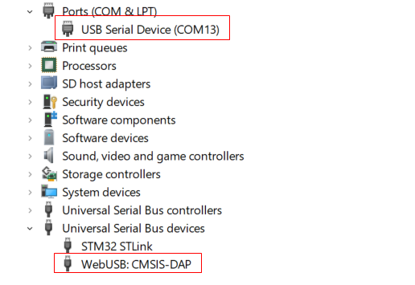

# DAPLink Getting Start

## 1. Source Code & hardware

* [https://daplink.io/](https://daplink.io/)
* [https://github.com/ARMmbed/DAPLink](https://github.com/ARMmbed/DAPLink)
* [DAPLink for developer](https://github.com/ARMmbed/DAPLink/blob/main/docs/DEVELOPERS-GUIDE.md)

* [hardware - Github](https://github.com/ARMmbed/mbed-HDK)
* [hardware - 百度云](https://pan.baidu.com/s/1NktC9op43o8bOS94AL68eQ?pwd=amif)

## 2. Debug software tool 

* [https://github.com/pyocd/pyOCD](https://github.com/pyocd/pyOCD)
* [https://pyocd.io/docs](https://pyocd.io/docs)


## 3. Compiler DAPLink sorce code

* install project-generator

```bash
pip install project-generator
```


* set python virtual env

```bash
$ cd DAPLink

$ pip install virtualenv

# create python virtual env
$ virtualenv venv

# activate python virtual env
$ source venv/bin/activate

# deactive python virtual
$ deactivated
```


DAPLink工程支持多款MCU，不同的MCU其工程名不一样，可以通过工程根目录下的 projects.yaml 文件查看，或者通过执行 DAPLinktools/projects_sort.py 查看：

```bash
$ python tools/projects_sort.py
```

以STM32F103RB为例，DAPLink分为两个工程：

* BootLoader(stm32f103xb_bl)，主要是用来升级DAPLink本身，编译后生成*.hex/*.bin，可通过STLink或者Jlink下载，运行时会以U盘的形式出现一个盘符：MAINTENANCE

```bash
$ python tools/progen_compile.py  --clean -v --parallel stm32f103xb_bl
```

* DAPLink Application(stm32f103xb_stm32f103rb_if)，该工程编译后，将*.hex/*.bin 拖入MAINTENANCE中，即可下载成功，下载成功后会自动重启，生成一个 DAPLINK 的盘符，查看任务管理器：

```bash
$ python tools/progen_compile.py  --clean -v --parallel stm32f103xb_stm32f103rb_if
```



## 3. DAPLink usage guide

* install pyocd

```bash
$ pip install pyocd
```

* permission to access USB devices for Linux System ([https://github.com/pyocd/pyOCD](https://github.com/pyocd/pyOCD))

```bash
$ sudo cp pyOCD/udev/*.rules /etc/udev/rules.d
$ sudo udevadm control --reload
$ sudo udevadm trigger 
```


