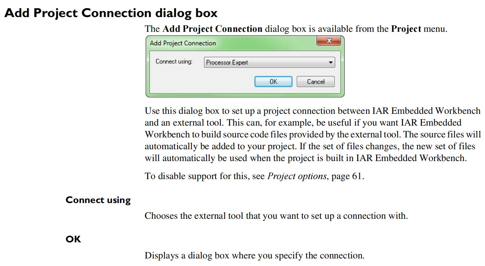
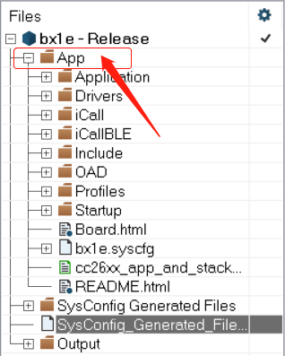

# IAR Projection Connection

研究TI CC2642的Demo工程时，发现IAR工程创建时用到了 *.ipcf 文件，这是IAR Project Connection功能的配置文件。

[文档第102页](https://wwwfiles.iar.com/8051/webic/doc/EW8051_IDEGuide.pdf)



## 1. IAR Project Connection功能简介

简单的说就是：事先将IAR项目的配置写在一个 *.ipcf 配置文件（XML）中，IAR启动时会去读取配置文件，并根据配置文件的设定初始化工程。

这个配置文件通常是外部工具软件生成的，“外部工具”指的是能工生成代码的配置工具，类似于CubeMX之类的，所以IAR Project Connection功能的目的就是与这些外部的代码生成工具联合起来，外部工具生成代码并生成icpf文件，IAR根据icpf文件将生成的代码融合进IAR工程里。（像CubeMX之类的工具能直接生成IAR工程，所以IAR Project Connection功能似乎用处并不大；可能主要针对不能直接进生成IAR工程的工具使用吧）。

目前IAR支持的外部工具：IAR Project Connection，Freescale processor expert和Infineon DAVE。


* test.ipcf

```xml
<?xml version="1.0" encoding="UTF-8"?>
<!-- IAR Project Connection File -->

<iarProjectConnection version="1.2" name="App" oneShot="true"
    xmlns:xsi="http://www.w3.org/2001/XMLSchema-instance"
    xsi:noNamespaceSchemaLocation="IarProjectConnection_1.2.xsd">

    <device>
        <name>CC2642R1F</name>
    </device>

    <asmIncludePath>
        <path>$PROJ_DIR$</path>
    </asmIncludePath>

    <includePath>
        <path>$PROJ_DIR$/Application</path>
    </includePath>

    <defines>
        <define>TIRTOS7_SUPPORT</define>
    </defines>

    <extraOptions>
        <args>
            <arg>--no_path_in_file_macros</arg>
        </args>
    </extraOptions>

    <linkerFile>
        <override>true</override>
        <path>$PROJ_DIR$/cc26xx_app_and_stack_agama_tirtos7.icf</path>
    </linkerFile>

    <linkerExtraOptions>
        <args>
            <arg>--cpu=Cortex-M4F</arg>
        </args>
    </linkerExtraOptions>

    <customBuildTools>
        <customBuildTool atRoot="true" name="SysConfig"> <!-- Custom build tool for entire project-->
            <fileExtensions>.syscfg</fileExtensions>
            <command>$SYSCONFIG_ROOT$/sysconfig_cli.bat -o $PROJ_DIR$ -s "$SIMPLELINK_CC13XX_CC26XX_SDK_INSTALL_DIR$/.metadata/product.json" --compiler iar $FILE_PATH$
            </command>
            <output>
                <path>SysConfig_Generated_Files.ipcf</path>
            </output>
            <hasPrio>true</hasPrio> <!-- true: run this tool before all other tools-->
        </customBuildTool>
    </customBuildTools>

    <heaps>
        <heap> <!-- If omitted, id="0" -->
            <size>0</size>
        </heap>
        <heap id="1">
            <size>0</size>
        </heap>
    </heaps>
    <stacks>
        <stack> <!-- If omitted, id="0" -->
            <size>512</size>
        </stack>
    </stacks>


    <postBuild>
        <command>$SIMPLELINK_CC13XX_CC26XX_SDK_INSTALL_DIR$/tools/ble5stack/oad/oad_postbuild.bat $TARGET_BPATH$ $PROJ_DIR$ $CONFIG_NAME$ $PROJ_FNAME$ $SIMPLELINK_CC13XX_CC26XX_SDK_INSTALL_DIR$ $EXE_DIR$ $TARGET_BNAME$</command>
    </postBuild>

    <files>
        <path reference="$PROJ_DIR$/Board.html">$SIMPLELINK_CC13XX_CC26XX_SDK_INSTALL_DIR$/source/ti/boards/CC26X2R1_LAUNCHXL/Board.html</path>
        <path copyTo="$PROJ_DIR$/cc26xx_app_and_stack_agama_tirtos7.icf">$SIMPLELINK_CC13XX_CC26XX_SDK_INSTALL_DIR$/examples/rtos/CC26X2R1_LAUNCHXL/ble5stack/project_zero/tirtos7/iar/cc26xx_app_and_stack_agama_tirtos7.icf</path>
        <path copyTo="$PROJ_DIR$/bx1e.syscfg">$SIMPLELINK_CC13XX_CC26XX_SDK_INSTALL_DIR$/examples/rtos/CC26X2R1_LAUNCHXL/ble5stack/project_zero/tirtos7/project_zero.syscfg</path>
        <path copyTo="$PROJ_DIR$/README.html">$SIMPLELINK_CC13XX_CC26XX_SDK_INSTALL_DIR$/examples/rtos/CC26X2R1_LAUNCHXL/ble5stack/project_zero/README.html</path>
        <group name="Application" build="true">
            <path copyTo="$PROJ_DIR$/Application/project_zero.c">$SIMPLELINK_CC13XX_CC26XX_SDK_INSTALL_DIR$/examples/rtos/CC26X2R1_LAUNCHXL/ble5stack/project_zero/Application/project_zero.c</path>
            <path copyTo="$PROJ_DIR$/Application/project_zero.h">$SIMPLELINK_CC13XX_CC26XX_SDK_INSTALL_DIR$/examples/rtos/CC26X2R1_LAUNCHXL/ble5stack/project_zero/Application/project_zero.h</path>
        </group>

        <group name="Startup" build="true">
            <path reference="$PROJ_DIR$/Startup/find_stack_entry.h">$SIMPLELINK_CC13XX_CC26XX_SDK_INSTALL_DIR$/source/ti/ble5stack/profiles/oad/cc26xx/find_stack_entry.h</path>
            <path copyTo="$PROJ_DIR$/Startup/main.c">$SIMPLELINK_CC13XX_CC26XX_SDK_INSTALL_DIR$/examples/rtos/CC26X2R1_LAUNCHXL/ble5stack/project_zero/Startup/main.c</path>
        </group>
    </files>
</iarProjectConnection>

```


* ```name="App"```就是IAR中的工程名称
```xml
<iarProjectConnection version="1.2" name="App" oneShot="true"
    xmlns:xsi="http://www.w3.org/2001/XMLSchema-instance"
    xsi:noNamespaceSchemaLocation="IarProjectConnection_1.2.xsd">

...

</iarProjectConnection>
```




* 下面这些对应得都是IAR工程 Options 中的参数设置项
```xml
 <device>
        <name>CC2642R1F</name>
    </device>

    <asmIncludePath>
        <path>$PROJ_DIR$</path>
    </asmIncludePath>

    <includePath>
        <path>$PROJ_DIR$/Application</path>
    </includePath>

    <defines>
        <define>TIRTOS7_SUPPORT</define>
    </defines>
```

* ```<files>```中的是IAR工程中的文件，```<group>```就是IAR的group也就是一个文件夹，```<group>```中的文件都会出现在IAR工程的该文件夹里，其他文件则会在工程名文件夹也就是```App```文件夹根目录下
```xml
<files>
        <path reference="$PROJ_DIR$/Board.html">$SIMPLELINK_CC13XX_CC26XX_SDK_INSTALL_DIR$/source/ti/boards/CC26X2R1_LAUNCHXL/Board.html</path>
        <path copyTo="$PROJ_DIR$/cc26xx_app_and_stack_agama_tirtos7.icf">$SIMPLELINK_CC13XX_CC26XX_SDK_INSTALL_DIR$/examples/rtos/CC26X2R1_LAUNCHXL/ble5stack/project_zero/tirtos7/iar/cc26xx_app_and_stack_agama_tirtos7.icf</path>
        <path copyTo="$PROJ_DIR$/bx1e.syscfg">$SIMPLELINK_CC13XX_CC26XX_SDK_INSTALL_DIR$/examples/rtos/CC26X2R1_LAUNCHXL/ble5stack/project_zero/tirtos7/project_zero.syscfg</path>
        <path copyTo="$PROJ_DIR$/README.html">$SIMPLELINK_CC13XX_CC26XX_SDK_INSTALL_DIR$/examples/rtos/CC26X2R1_LAUNCHXL/ble5stack/project_zero/README.html</path>
        <group name="Application" build="true">
            <path copyTo="$PROJ_DIR$/Application/project_zero.c">$SIMPLELINK_CC13XX_CC26XX_SDK_INSTALL_DIR$/examples/rtos/CC26X2R1_LAUNCHXL/ble5stack/project_zero/Application/project_zero.c</path>
            <path copyTo="$PROJ_DIR$/Application/project_zero.h">$SIMPLELINK_CC13XX_CC26XX_SDK_INSTALL_DIR$/examples/rtos/CC26X2R1_LAUNCHXL/ble5stack/project_zero/Application/project_zero.h</path>
        </group>

        <group name="Startup" build="true">
            <path reference="$PROJ_DIR$/Startup/find_stack_entry.h">$SIMPLELINK_CC13XX_CC26XX_SDK_INSTALL_DIR$/source/ti/ble5stack/profiles/oad/cc26xx/find_stack_entry.h</path>
            <path copyTo="$PROJ_DIR$/Startup/main.c">$SIMPLELINK_CC13XX_CC26XX_SDK_INSTALL_DIR$/examples/rtos/CC26X2R1_LAUNCHXL/ble5stack/project_zero/Startup/main.c</path>
        </group>
    </files>
```