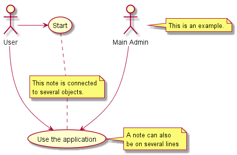
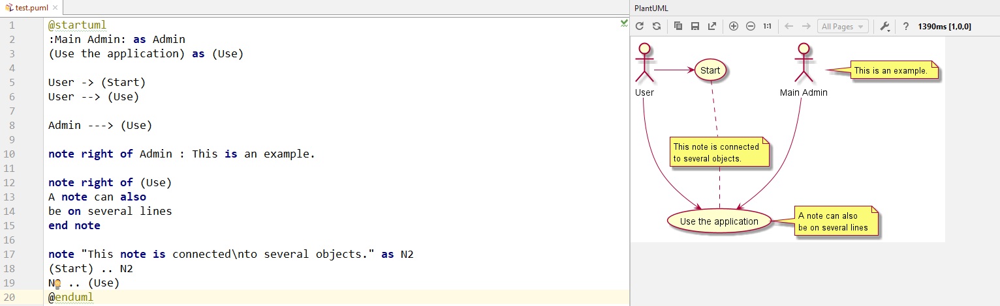

# UML Tool

## Resources
* [PlantUML Office Site](http://plantuml.com/)
* [Graphviz Office Site](https://www.graphviz.org/)
* [Install Graphviz for PlantUML](http://plantuml.com/graphviz-dot)
* [Download plantuml.jar](https://sourceforge.net/projects/plantuml/files/plantuml.jar)
* Set "graphviz/bin" path to environment variables.


## PlantUML for Notepad++
* [PlantUML for Notepad++](https://github.com/FanHongchuang/PlantUML_Notepad-_UDL)

### Test with Notepad++
* Create a new txt file with PlantUML commands, like this example called test_uml.txt

```uml
@startuml
:Main Admin: as Admin
(Use the application) as (Use)

User -> (Start)
User --> (Use)

Admin ---> (Use)

note right of Admin : This is an example.

note right of (Use)
A note can also
be on several lines
end note

note "This note is connected\nto several objects." as N2
(Start) .. N2
N2 .. (Use)
@enduml
```

* Then, run PlantUML, using test_uml.txt as input. The output is an image.

```java
java -jar plantuml.jar test_uml.txt
```

* The result is:



!!! note
    It only is sytax highlighting support for PlantUML user defined language defined for Notepad++, the real program is plantuml.jar.


## PlantUML for Android Studio
* File -> Settings -> Plug -> Browse Repositories
* Then search "plantuml"
* Then install it

### Test with Android Studio
* File -> New -> UML Use Case -> "test.puml"

* The result is:
