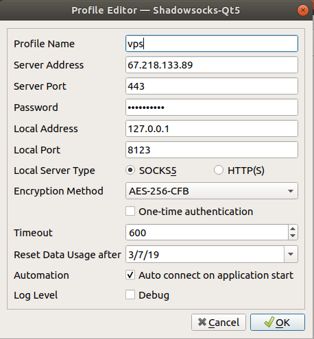
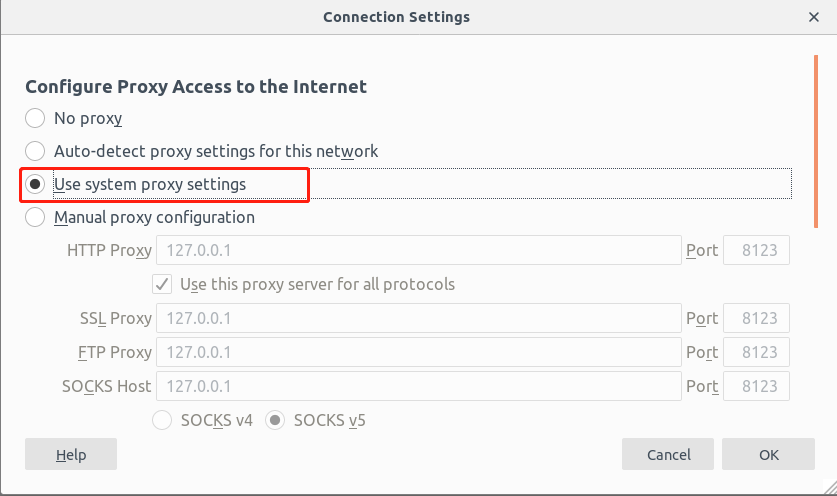

# Shadowsocks for Ubuntu

## 1. Install Shadowsocks

* Ubuntu16.04 and above
```bash
sudo add-apt-repository ppa:hzwhuang/ss-qt5
sudo apt-get update
sudo apt-get install shadowsocks-qt5
```
* Ubuntu18.04

```bash
sudo vim /etc/apt/sources.list.d/hzwhuang-ubuntu-ss-qt5-bionic.list

deb http://ppa.launchpad.net/hzwhuang/ss-qt5/ubuntu xenial main
# deb-src http://ppa.launchpad.net/hzwhuang/ss-qt5/ubuntu xenial main
```

## 2. 启动Shadowsocks-qt5并配置

!!! Note
    此处的账号真实有效，需要密码的同学请私信我哦！




## 3. 配置系统代理
```bash
// 直接从gfwlist网站获取gfwlist.txt文件
genpac --pac-proxy "SOCKS5 127.0.0.1:8123" --gfwlist-proxy="SOCKS5 127.0.0.1:8123" --gfwlist-url=https://raw.githubusercontent.com/gfwlist/gfwlist/master/gfwlist.txt --output="autoproxy.pac"

// 假如无法访问gfwlist，直接使用浏览器访问其网址，下载gfwlist.txt文件，然后执行下面的命令
genpac --pac-proxy "SOCKS5 127.0.0.1:8123" --gfwlist-proxy="SOCKS5 127.0.0.1:8123" --gfwlist-local=./gfwlist.txt --output="autoproxy.pac"

```
* Network -> Network Proxy -> Automatic 在Configuration URL中
```
file:///home/fhc/autoproxy.pac
```

## 4. 在浏览器中配置使用系统代理



## 5. 命令行使用系统代理
```bash
sudo apt-get install proxychains4

proxychains4 curl www.google.com


```