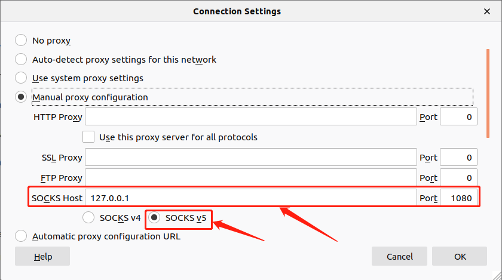

# 1.Clone or download project

``` bash
~ $ git clone https://github.com/showzeng/shadowsocksr
```

# 2.Usage for single user on linux platform

Fill in your configuration file (shadowsocksr/config.json):

``` json
{
    "server": "0.0.0.0",
    "server_ipv6": "::",
    "server_port": 8388,
    "local_address": "127.0.0.1",
    "local_port": 1080,

    "password": "m",
    "method": "aes-128-ctr",
    "protocol": "auth_aes128_md5",
    "protocol_param": "",
    "obfs": "tls1.2_ticket_auth_compatible",
    "obfs_param": "",
    "speed_limit_per_con": 0,
    "speed_limit_per_user": 0,

    "additional_ports" : {},
    "additional_ports_only" : false,
    "timeout": 120,
    "udp_timeout": 60,
    "dns_ipv6": false,
    "connect_verbose_info": 0,
    "redirect": "",
    "fast_open": false
}
```

You need config your configuration with these items:

``` json
{
    "server": "0.0.0.0",
    "server_port": 8388,

    "password": "m",
    "method": "aes-128-ctr",
    "protocol": "auth_aes128_md5",
    "obfs": "tls1.2_ticket_auth_compatible",
}
```

Then turn on your terminal and get into "shadowsocksr/" folder. Excute the command as below:

``` text
~/shadowsocksr [manyuser] $ chmod 755 runssr stopssr

~/shadowsocksr [manyuser] $ sudo mv runssr stopssr /usr/local/bin
[sudo] password for xxxx: 

~/shadowsocksr [manyuser] $ ../

~ $ sudo mv shadowsocksr/ /opt/

~ $ source /etc/profile
```

Once done with that, you can turn on/off shadowsocksR with these simple command at anytime as you wish :p , such as you just open your computer.

# 3.Turn on/off SSR

``` text
~ $ runssr
```

``` text
~ $ stopssr
```

# 4.install proxychains4

```bash
sudo apt-get install proxychains4
```

# 5.configure proxychains4
```bash
# 打开配置文件
sudo vim /etc/proxychains4.conf

# 在文件末尾添加
socks5 127.0.0.1 1080

```

### 6. install curl
```bash
sudo apt-get install curl
```

### 7.test

you are success, test it.

!!! Warning
    不能用ping命令测试，因为proxychains只支持使用tcp或udp协议的程序。
	ping用的是ICMP协议，不以tcp或udp为基础，所以用不了。

```bash
proxychains4 curl www.google.com
```

# 8. configure the browser

Eg: FireFox

