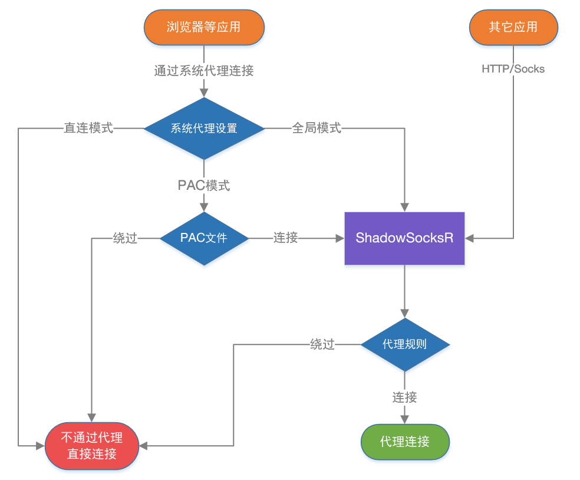

# SSR的配置参数

## 1. ShadowsocksR中的代理规则

[参考链接](https://vimcaw.github.io/blog/2018/03/12/Shadowsocks(R)%E8%AE%BE%E7%BD%AE%EF%BC%9A%E7%B3%BB%E7%BB%9F%E4%BB%A3%E7%90%86%E6%A8%A1%E5%BC%8F%E3%80%81PAC%E3%80%81%E4%BB%A3%E7%90%86%E8%A7%84%E5%88%99/)

ShadowsocksR目前分两种规则方式，那就是 PAC规则（系统代理模式） 和 代理规则 。

PAC规则 是根据PAC文件中的黑白地址名单来判断那些网站走代理。也就是判断 流量是否进入客户端。

当你要访问的网站满足 PAC里的设置，那么浏览器就会向代理服务器也就是客户端发送网站请求数据，这时候我们才进入了ShadowsocksR客户端，接下来我们就进入了代理规则判断环节。

代理规则 是根据IP判断，按设定的规则来判断进入 客户端的流量是直连还是走代理。

当你访问 XXX 网站，然后是全局或者满足PAC条件从而访问 XXX网站的请求数据流量进入了客户端，然后客户端会根据 XXX网站的IP来判断，如下：

绕过局域网，当IP属于局域网内的，那么SSR客户端就会让流量直连，反之则会让流量走代理（发送到SSR服务端）。
绕过局域网和大陆，当IP属于大陆内或局域网的，那么SSR客户端就会让流量直连，反之则会让流量走代理（发送到SSR服务端）。
绕过局域网和非大陆，当IP属于大陆外(非大陆IP都算大陆外)或局域网的，那么SSR客户端就会让流量直连，反之则会让流量走代理（发送到SSR服务端）。
这两种判断方式是相互配合使用的，先用系统代理模式来判断是否让数据进入SSR客户端，再用代理规则来判断进入SSR客户端的数据是直连还是走代理。

举个栗子：假设系统代理模式为 PAC，那么访问 www.google.com ，浏览器在PAC文件中匹配这个域名，并发现这个域名按PAC规则规则应走代理，所以 浏览器就会发送 访问网页数据到 PAC中的代理服务器(默认如127.0.0.1:1080)，于是SSR客户端就收到了 访问谷歌的数据，而这时候就该用 代理规则 判断了。

首先代理规则为：绕过局域网，则判断 www.google.com 域名的IP是否是局域网IP，然而不是局域网IP，于是走代理。

代理规则为：绕过局域网和大陆，则判断 www.google.com 域名的IP是否是局域网IP 或 大陆IP，然而不是局域网IP或大陆IP，于是走代理。

代理规则为：绕过局域网和非大陆，则判断 www.google.com 域名的IP是否是局域网IP 或 非大陆IP，然而是非大陆IP，于是不走代理，直连。

代理规则为：全局，不判断 www.google.com 域名的IP，直接走代理。

## 2.ShadowsocksR中的本地代理

本地代理 主要是给自己的 本机软件 和 局域网内其他设备 用的。

假设你设置的本地代理端口是默认的 1080 ，然后你这个电脑在局域网内的 内网IP是 192.168.0.5 。

本机软件，比如 IDM 想要经过ShadowsocksR下载墙外的内容，那么你可以IDM设置代理服务器 Socks5代理 127.0.0.1:1080 ，然后 IDM 就会通过ShadowsocksR下载墙外的文件了。

其他设备比如，你安卓手机想要不通过安卓客户端连接同局域网内的电脑上的ShadowsocksR，那么在安卓的设置中 设置代理服务器 192.168.0.5:1080 就可以连接到你电脑的 ShadowsocksR了，其他设备也是一样。

同局域网内其他设备想要链接你这个电脑上面的ShadowsocksR，只要在他们的浏览器或系统代理设置 设置为 192.168.0.5:1080 就行了，不需要开ShadowsocksR客户端。

## 3.ShadowsocksR中的二级(前置)代理

二级(前置)代理指的是：当你链接Shadowsocks服务器的时候，并不会直接连接Shadowsocks服务器，而是先链接 二级(前置)代理服务器，然后二级(前置)代理服务器再去链接Shadowsocks服务器，可以达到 隐藏自己的IP 或 通过国内中转(国内服务器搭建代理服务器)来加速Shadowsocks。

同时上面提到的代理规则，就是给二级(前置)代理使用的，当你设置 代理规则 —— 全局 的时候，你访问国内的网站，你也是走代理服务器的，而你访问海外的网站也是先链接代理服务器然后再链接Shadowsocks服务器的，达到任何情况隐藏自己真实IP的目的，当然还有其他的作用就不一一说明了。

还有就是，二级(前置)代理，还有个主要使用情况是：

部分企业/学校 要链接互联网，必须要用 企业/学校 提供的HTTP代理服务器(一般都是为了防止你访问不该访问的网站)。

这样你就先链接 企业/学习 提供的代理服务器，然后再链接ShadowsocksR，然后利用ShadowsocksR的混淆特性，可以突破 企业/学校 的代理服务器网站限制封锁。