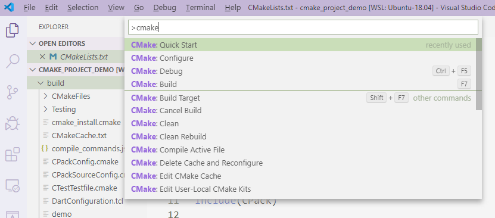
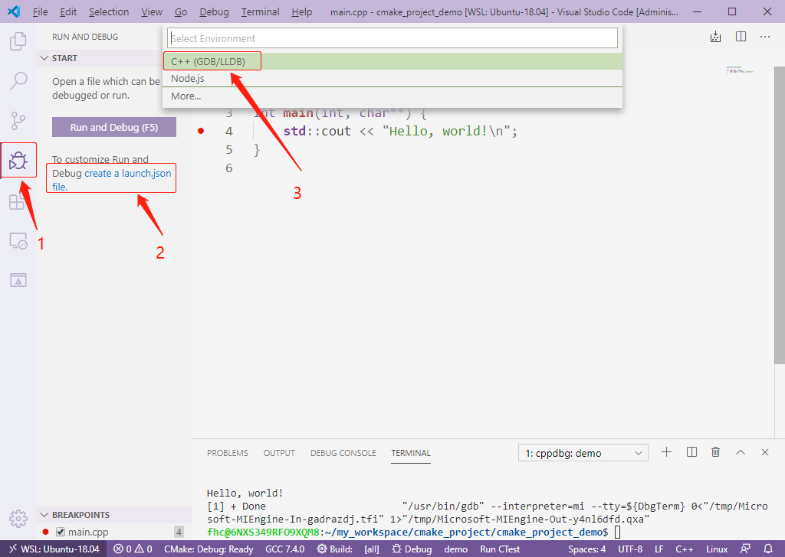
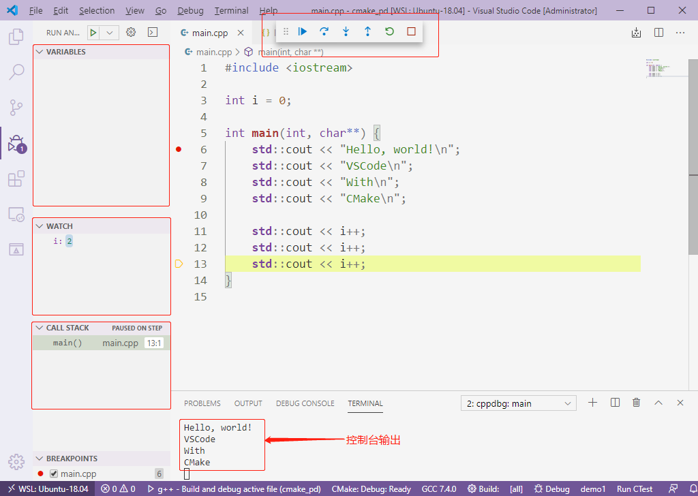

# VSCode与CMake搭配使用之基本配置

## 1.首先安装VSCode插件CMake和CMake Tools


* CMake插件主要功能是CMake语法高亮、自动补全
* CMake Tools的功能主要是结合VSCode IDE使用CMake这个工具，比如生成CMakeLists.txt、构建项目、调试项目等


## 2.新建CMake项目

```Ctrl+Shift+p```打开VSCode的指令面板，然后输入```cmake:q```，VSCode会根据输入自动提示，然后选择```CMake: Quick Start```


然后选择适合你的编译器（VSCode会将你安装的编译器都罗列出来供你选择。如果你是交叉编译，那么就可以在这里配置你的交叉编译器）,为方便演示这里我们选择```GCC7.4.0```：


然后根据提示输入项目名称:


然后选择该项目是创建库还是可执行文件，为了演示方便这里我们选择可执行文件```Executable```：


然后VSCode就会为你生成一个CMake项目，如下所示：


* build文件夹是```cmake```指令的输出文件夹
* 默认生成的```CMakeLists.txt```文件
* 默认生成的```main.cpp```文件

## 3. 编译项目

当然你可以在命令行中执行：

```shell
cd build
cmake ..
```

但是VSCode提供了更便捷的方式（点击底部的Build）:


或者在VSCode的命令面板中选择build命令（输入cmake后VSCode会帮你列出所有支持的命令）：



## 4. 调试

首先在源码中打上断点：


然后配置调试环境：




然后就会自动跳入调试界面：



下次进入调试有两种方法：

1. 点击VSCode底部的Debug选项
2. ```Ctrl+Shift+p```在VSCode的命令面板中选择```CMake:Debug```

## 5.参考链接

[CMake Tools官方文档](https://vector-of-bool.github.io/docs/vscode-cmake-tools/getting_started.html)