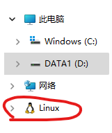
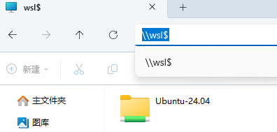
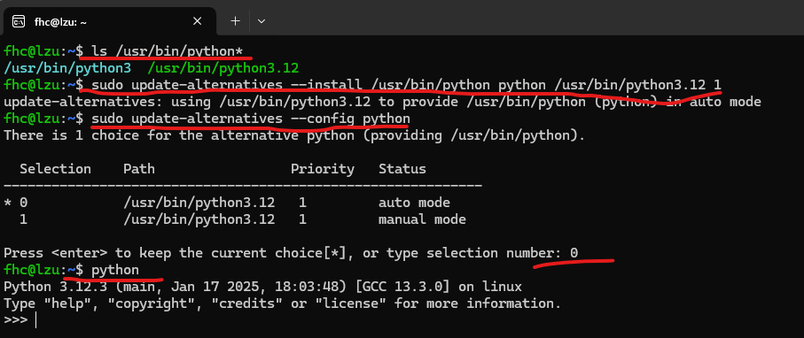

## WSL install

```
wsl --list --online 或 wsl -l -o

wsl --install -d <Distribution Name>

```

### raw.githubusercontent.com 无法访问问题解决
  
* 在 [https://site.ip138.com/](https://site.ip138.com/) 上查询 raw.githubusercontent.com 的IP地址
* 将IP地址设置到Host文件
```
# C:\Windows\System32\drivers\etc\hosts

185.199.110.133 raw.githubusercontent.com

```

## WLS 与 Windows文件互相访问





```
\\wsl$
```

## Python设置



```
ls /usr/bin/python*

sudo update-alternatives --install /usr/bin/python python /usr/bin/python3.12 1 && sudo update-alternatives --config python
```