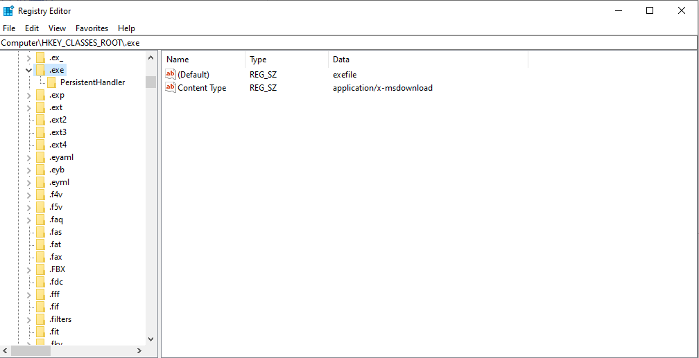
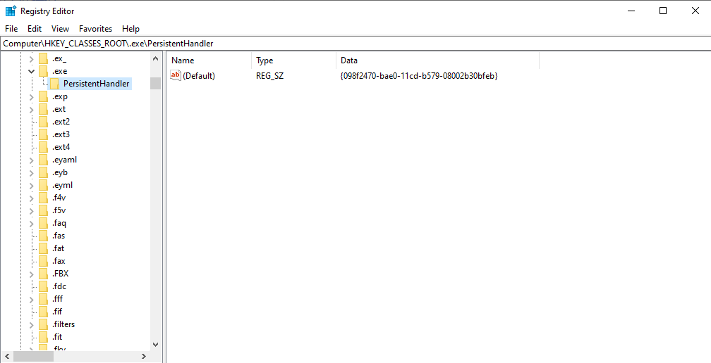

# 电脑上文件关联的启动程序错误的解决方案

* 首先解决.exe文件的关联错误

打开注册表，找到如下选项:

```
HKEY_CLASSES_ROOT\.exe
```
修改成如下图所示的值：

```
# .exe
(Default) exefile
Content Type application/x-msdownload

# .exe/PersistentHandler
(Default) {098f2470-bae0-11cd-b579-08002b30bfeb}
```





exe文件能够正常执行后，就可以使用360安全卫士的系统修复功能修复电脑的其他问题了。


