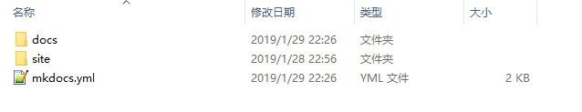
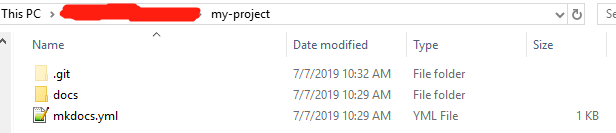
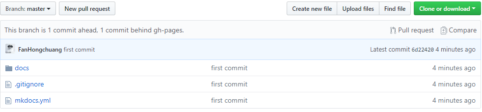
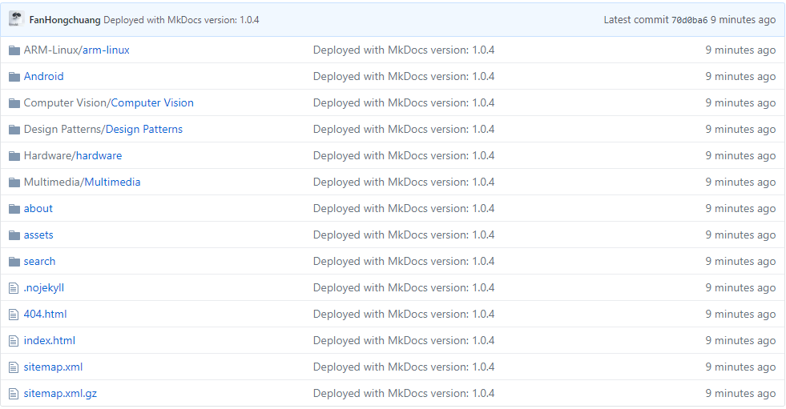

# Wiki创建向导
欢迎来到我的WiKi。

假如你也想搭建这样一个WiKi，请往下看。

## 1. 使用Notepad++(可选)
Notepad++是一款非常实用的编辑器，并且十分小巧，推荐大家使用！

* [Notepad++ Download](https://notepad-plus-plus.org/download)
* [Explorer Plug](https://github.com/funap/npp-explorer-plugin/releases)

## 2. 安装MKDocs和Material主题
* [MKDocs官方网站](https://www.mkdocs.org)
> MKDocs是一个可以将Markdown文件转换成HTML网页文件的程序
* [Material主题官方网站](https://squidfunk.github.io/mkdocs-material)
> Material主题是一个漂亮的网页样式
* 根据官方的指导配置你的网站, 并添加内容

* 现在你的WiKi看上去将会是这个样子:




## 3. 将你的WiKi网站托管到Github
###3.1 将你的“my-project”文件夹，初始化为一个本地Git仓库
```bash
cd my-project
git init
```
* git仓库初始化成功后，看上去就像这样：



###3.2 创建一个新GitHub的仓库，获取仓库的URL。像这样: 
```
https://github.com/user_name/repository_name
```

###3.3 在本地仓库中添加远程仓库链接
```bash
git add remote https://github.com/user_name/repository_name
```
###3.4 将本地git仓库推送到远端（可选）
> 将你的源文件推送到远程仓库是可选的，因为部署你的WiKi网站只需要将HTML网页文件推送到远端即可
```bash
git add .
git commit -m "first commit"
git push origin master
```
###3.5 将你的WiKi站点部署到GitHub
```bash
mkdocs gh-deploy
```
* 完成部署之后，你的WiKi网站的HTML文件都部署在了gh-pages分支；markdown文件都部署在了master分支（假如你提交了的话）

* 这是master分支:



* 这是gh-pages分支:



* 现在使用类似下面的URL，你就可以访问你的Wiki站点了

```
https://user_name.github.io/repository_name/
```

!!! 恭喜
    现在你的WiKi已经成功部署。

## 更多精彩资讯，请扫码关注！
