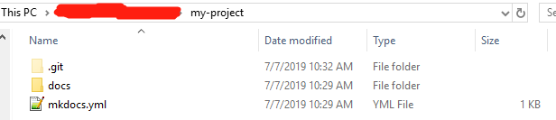

# Wiki Create Guide
[中文请点击这里](index-zh.md)

Welcome to My WiKi!

If you want to build a wiki like this. Please follow me.

##1. Use Notepad++(Optional)
Notepad++ is a very useful editor, and very small, recommended to use!

* [Notepad++ Download](https://notepad-plus-plus.org/download)
* [Explorer Plug](https://github.com/funap/npp-explorer-plugin/releases)

##2. Install MKDocs
* [MKDocs Office Website](https://www.mkdocs.org)
> MKDocs is a program that converts Markdown files into HTML web page files
* [Material Theme Office Website](https://squidfunk.github.io/mkdocs-material)
> The Material Theme is a beautiful web page style
* Config your site according to official instructions, and add something

* Now your site looks like this:


##3. Host Your Site To Github
###3.1 Init a local Git repository in "my-project" folder
```bash
cd my-project
git init
```
* After success, it looks like it：



###3.2 Create a new GitHub repository，and get the URL.Look like it: 
```
https://github.com/user_name/repository_name
```

###3.3 Add a remote repository link for your local repository
```bash
git add remote https://github.com/user_name/repository_name
```
###3.4 Push local repository to remote（Optional）
> It is optional,because deploy your WiKi site only need to push HTML files to remote.
```bash
git add .
git commit -m "first commit"
git push origin master
```
###3.5 Deploy your WiKi site on the GitHub
```bash
mkdocs gh-deploy
```
* After deploy,the HTML files of your WiKi site is deployed on the gh-pages branch,and the Markdown files is deployed on the master branch(if you push it).

* It is master branch:


* It is gh-pages branch:


* Now you can access your WiKi site use the URL like this:
```
https://user_name.github.io/repository_name/
```

!!! success
    It is OK.

## Scan code attention my WeChat official account
