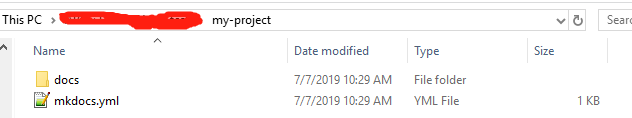

# Wiki Create Guide

## Use Notepad++(Optional)
* [Notepad++ Download](https://notepad-plus-plus.org/download)
* [Explorer Plug](https://github.com/funap/npp-explorer-plugin/releases)

## Install MKDocs
* [MKDocs Office Website](https://www.mkdocs.org)
* [Material Theme Office Website](https://squidfunk.github.io/mkdocs-material)
* Config your site, and add your notebooks

* Now your site looks like this:




## Host Your Site To Github
* Create a new repository. Example: https://github.com/user_name/repository_name
* Initialize your local git repository, and add remote github repository, and push it

```bash
cd your_site_path
git init
git add remote https://github.com/user_name/repository_name
git add .
git commit -m "first commit"
git push origin master
```
* Deploy your site

```bash
mkdocs gh-deploy
```
* So your site(html files) on the gh-pages branch, and your site(markdown files) on the master branch

It is master branch:


It is gh-pages branch:


!!! success
    It is OK.

